# Content Engine — The Flowcharts

*2026-09-08. The picture of [`content-engine-runtime-spec.md`](content-engine-runtime-spec.md).*

**This file holds the diagrams and nothing else.** Every rule and citation lives in the runtime
spec; this is the same mechanism drawn. Station numbers ①–㉚ are the spec's numbering — **①–⑱ are the line,
**⑲ ⑳ ㉑ ㉒ sit across it** (§9A) and **㉓–㉚ are the operating model** (§9B).

> **§0 is the version to present.** Two diagrams, a line to say for each box, and the three questions
> somebody will ask. **§1–§10 are the engineering view** — the same machine, at the detail a build needs.

**Worked examples:** [`content-engine-example.md`](content-engine-example.md).

---

## Legend

| | |
|---|---|
| 🟢 **green** | Joy has specified it. Cited in the spec |
| 🟡 **amber** | **NEW** — our addition, inside her rules |
| 🔴 **red** | **GAP** — no spec exists yet |
| ⬛ **dark** | **HARD STOP** — the item is not produced, or does not publish |
| ⏱ | Daily clock |
| 📅 | Weekly clock |

---

## 0 · The one-minute version — start here

**Two diagrams. If you only show one thing, show these.**
The ten that follow are the same machine at engineering detail; these are the same machine at explaining
detail.

---

### 0.1 · Seven steps

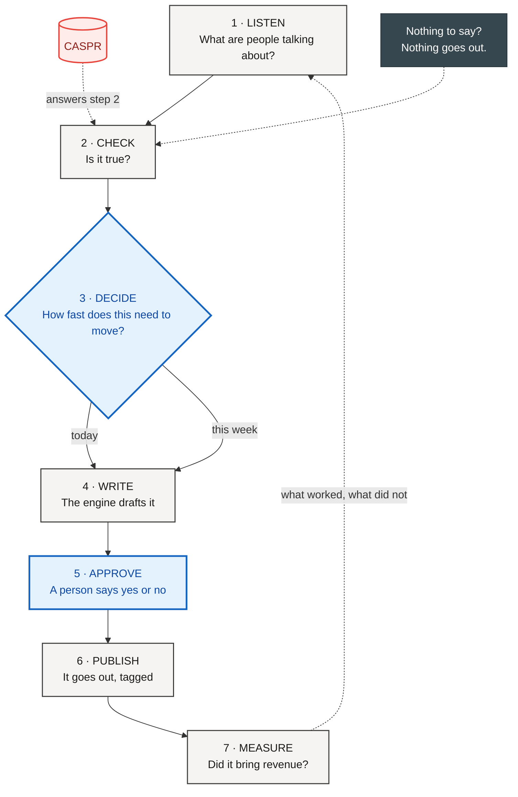
```mermaid
flowchart TD
    A["1 · LISTEN<br/>What are people talking about?"]
    B["2 · CHECK<br/>Is it true?"]
    C{"3 · DECIDE<br/>How fast does this need to move?"}
    D["4 · WRITE<br/>The engine drafts it"]
    E["5 · APPROVE<br/>A person says yes or no"]
    F["6 · PUBLISH<br/>It goes out, tagged"]
    G["7 · MEASURE<br/>Did it bring revenue?"]

    A --> B --> C
    C -->|"today"| D
    C -->|"this week"| D
    D --> E --> F --> G
    G -.->|"what worked, what did not"| A

    CASPR[("CASPR")] -.->|"answers step 2"| B
    NO["Nothing to say?<br/>Nothing goes out."] -.-> B

    classDef s fill:#f5f4f2,stroke:#3c3c3a,stroke-width:1.5px,color:#1a1a19
    classDef h fill:#e3f2fd,stroke:#1565c0,stroke-width:2.5px,color:#0d47a1
    classDef c fill:#fdecea,stroke:#e8453c,stroke-width:2px,color:#8e2019
    classDef n fill:#37474f,stroke:#263238,color:#ffffff
    class A,B,D,F,G s
    class C,E h
    class CASPR c
    class NO n
```

**How to say it, one line per box:**

| | Say this |
|---|---|
| **1 · Listen** | *"We read the rooms our buyers are actually in — daily, read-only. We never post automatically."* |
| **2 · Check** | *"Before we write anything, we ask Caspr whether it is true. **If we have nothing sourced to say, nothing goes out.** That is the whole brand in one rule."* |
| **3 · Decide** | *"Some things need answering today. Some things deserve a proper analysis. The engine sorts them."* |
| **4 · Write** | *"The engine drafts it — using our own voice rules, our own numbers, and the list of mistakes we have already corrected."* |
| **5 · Approve** | *"**A person always decides.** Approve, or reject with a reason. Rejections teach the engine, so the same mistake does not come back."* |
| **6 · Publish** | *"It goes out on the right channel, on the right day, tagged so we can trace what it earned. Community forums are posted by a human, always."* |
| **7 · Measure** | *"We can point at revenue and say which post brought it."* |

**The two boxes in blue are the human ones.** Everything else is the machine. That is the whole point of the
diagram: **about eighty minutes of human attention a week runs the entire thing.**

---

### 0.2 · Two clocks

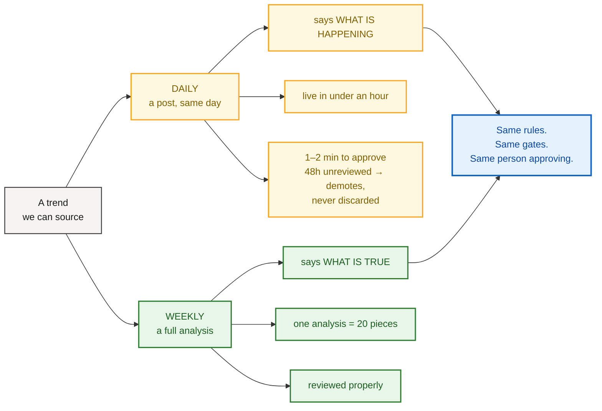
```mermaid
flowchart LR
    T["A trend<br/>we can source"]

    T --> D["DAILY<br/>a post, same day"]
    T --> W["WEEKLY<br/>a full analysis"]

    D --> D1["says WHAT IS HAPPENING"]
    D --> D2["live in under an hour"]
    D --> D3["1–2 min to approve<br/>48h unreviewed → demotes,<br/>never discarded"]

    W --> W1["says WHAT IS TRUE"]
    W --> W2["one analysis = 20 pieces"]
    W --> W3["reviewed properly"]

    D1 --> R["Same rules.<br/>Same gates.<br/>Same person approving."]
    W1 --> R

    classDef t fill:#f5f4f2,stroke:#3c3c3a,stroke-width:1.5px,color:#1a1a19
    classDef d fill:#fff8e1,stroke:#f9a825,stroke-width:2px,color:#7f5f00
    classDef w fill:#e8f5e9,stroke:#2e7d32,stroke-width:2px,color:#1b5e20
    classDef r fill:#e3f2fd,stroke:#1565c0,stroke-width:2.5px,color:#0d47a1
    class T t
    class D,D1,D2,D3 d
    class W,W1,W2,W3 w
    class R r
```

**How to say it:**

> *"A conversation happening today cannot wait until next Thursday. So the same trend gets answered twice —
> a post today saying what is happening, and an analysis in a couple of weeks saying what is true.*
>
> *Neither is a compromise. A rushed analysis is not an analysis, and a post that arrives after the
> conversation has moved on is not a post.*
>
> ***Same rules on both. Same person approving both.*** *Only the clock is different."*

---

### 0.3 · If someone asks "how much work is this for us?"

| | Per week |
|---|---|
| Items the engine produces | **~35–44** |
| **Human time to approve all of it** | **~85–115 minutes**, across three people |
| Time available | ~450 minutes |
| Things a person originates from scratch | **2.5** |

> *"The engine is not a writing machine. It is a fan-out machine. **Two or three real pieces of research a
> week become forty pieces of content** — and that ratio is the reason this is affordable at all."*

---

### 0.4 · If someone asks "what could go wrong?"

**Three answers, and having them ready is the point:**

| Risk | The answer |
|---|---|
| *"AI will publish something wrong"* | **Nothing publishes unreviewed. Ever.** There is no timeout that pushes it live. If nobody reviews, we skip the week — and skipping a week is a valid outcome |
| *"AI will publish something unsourced"* | **The engine refuses to write it.** Every item must carry a finding from a real Caspr analysis or a named person's opinion. No source, no draft |
| *"It will read like AI slop"* | **A machine checks the voice before a human sees it** — banned words, no exclamation points, no competitor in a headline. And every rejection is remembered, so the same fault does not recur |

---

# The detailed set

**From here on this is the engineering view.** Sections 1–10 are for building, not for presenting.

## 1 · The master flow — two clocks, eighteen stations

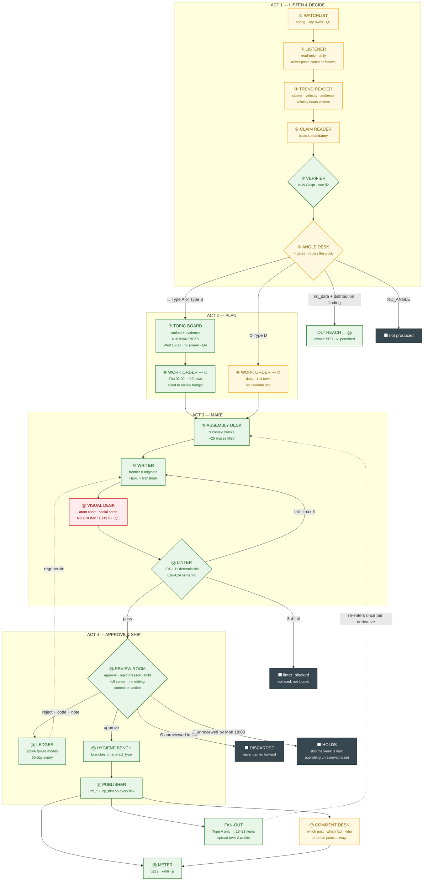
```mermaid
flowchart TD
    subgraph ACT1["ACT 1 — LISTEN &amp; DECIDE"]
        direction TB
        S1["① WATCHLIST<br/><small>config · Joy owns · Q1</small>"]
        S2["② LISTENER<br/><small>read-only · daily<br/>never posts, votes or follows</small>"]
        S3["③ TREND READER<br/><small>cluster · velocity · audience<br/>velocity beats volume</small>"]
        S4["④ CLAIM READER<br/><small>basis is mandatory</small>"]
        S5{"⑤ VERIFIER<br/><small>calls Caspr · see §2</small>"}
        S6{"⑥ ANGLE DESK<br/><small>4 gates · routes the clock</small>"}
        S1 --> S2 --> S3 --> S4 --> S5 --> S6
    end

    S6 -->|"📅 Type A or Type B"| S7
    S6 -->|"⏱ Type D"| S8D
    S6 -->|"no_data + distribution finding"| OUT["OUTREACH → ㉑<br/><small>owner: SEO · ✅ permitted</small>"]
    S6 -->|"NO_ANGLE"| STOP1["⬛ not produced"]

    subgraph ACT2["ACT 2 — PLAN"]
        direction TB
        S7["⑦ TOPIC BOARD<br/><small>ranked + evidence<br/>A HUMAN PICKS<br/>Wed 15:00 · no screen · Q4</small>"]
        S8W["⑧ WORK ORDER — 📅<br/><small>Thu 06:00 · ~23 rows<br/>sized to review budget</small>"]
        S8D["⑧ WORK ORDER — ⏱<br/><small>daily · 1–3 rows<br/>no calendar slot</small>"]
        S7 --> S8W
    end

    subgraph ACT3["ACT 3 — MAKE"]
        direction TB
        S9["⑨ ASSEMBLY DESK<br/><small>9 context blocks<br/>~25 braces filled</small>"]
        S10["⑩ WRITER<br/><small>frontier = originate<br/>Haiku = transform</small>"]
        S11["⑪ VISUAL DESK<br/><small>atom chart · social cards<br/>NO PROMPT EXISTS · Q5</small>"]
        S12{"⑫ LINTER<br/><small>L01–L11 deterministic<br/>L20–L24 semantic</small>"}
        S9 --> S10 --> S11 --> S12
    end

    S8W --> S9
    S8D --> S9
    S12 -->|"fail · max 3"| S10
    S12 -->|"3rd fail"| BLOCK["⬛ linter_blocked<br/><small>surfaced, not looped</small>"]
    S12 -->|"pass"| S13

    subgraph ACT4["ACT 4 — APPROVE &amp; SHIP"]
        direction TB
        S13{"⑬ REVIEW ROOM<br/><small>approve · reject+reason · hold<br/>full screen · no editing<br/>commit on action</small>"}
        S14["⑭ LEDGER<br/><small>active failure modes<br/>60-day expiry</small>"]
        S15["⑮ HYGIENE BENCH<br/><small>branches on artefact_type</small>"]
        S16["⑯ PUBLISHER<br/><small>utm_* + icp_hint on every link</small>"]
        S13 -->|"reject + code + note"| S14
        S13 -->|"approve"| S15 --> S16
    end

    S14 -.->|"regenerate"| S10
    S13 -->|"⏱ unreviewed in 24h"| EXP["⬛ DISCARDED<br/><small>never carried forward</small>"]
    S13 -->|"📅 unreviewed by Mon 18:00"| HOLD["⬛ HOLDS<br/><small>skip the week is valid<br/>publishing unreviewed is not</small>"]

    S16 --> S17["⑰ COMMENT DESK<br/><small>which post · which fact · who<br/>a human posts, always</small>"]
    S16 --> FAN["FAN-OUT<br/><small>Type A only → 16–23 items<br/>spread over 2 weeks</small>"]
    FAN -.->|"re-enters once per derivative"| S9

    S16 --> S18["⑱ METER<br/><small>x@3 · x@6 · p</small>"]
    S17 --> S18

    classDef joy fill:#e8f5e9,stroke:#2e7d32,stroke-width:1.5px,color:#1b5e20
    classDef new fill:#fff8e1,stroke:#f9a825,stroke-width:1.5px,color:#7f5f00
    classDef gap fill:#ffebee,stroke:#c62828,stroke-width:2px,color:#8e0000
    classDef stop fill:#37474f,stroke:#263238,stroke-width:1.5px,color:#ffffff

    class S1,S2,S3,S4,S6,S8D,S17 new
    class S5,S7,S8W,S9,S10,S12,S13,S14,S15,S16,S18,FAN,OUT joy
    class S11 gap
    class STOP1,BLOCK,EXP,HOLD stop
```

---

## 2 · ⑤ The Verifier — the only station that calls Caspr

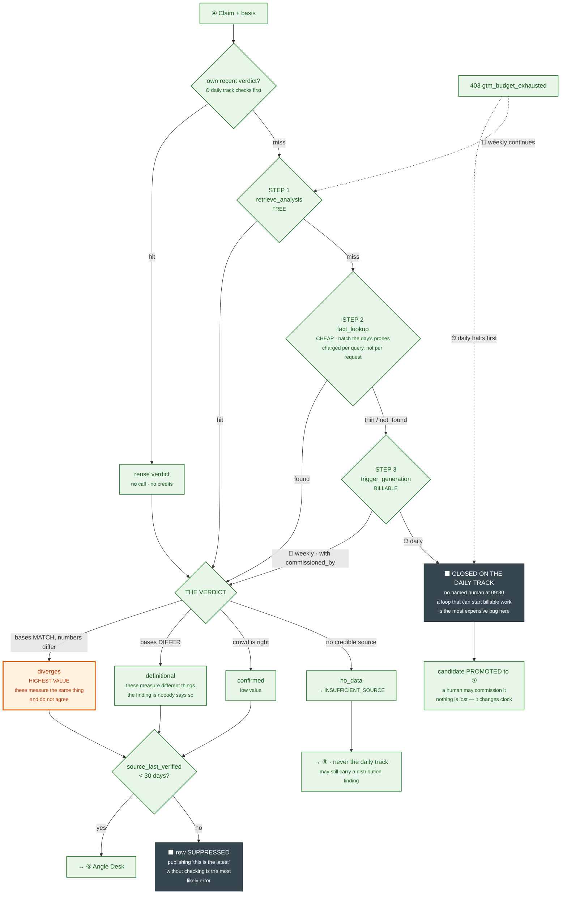
```mermaid
flowchart TD
    IN["④ Claim + basis"] --> CACHE{"own recent verdict?<br/><small>⏱ daily track checks first</small>"}
    CACHE -->|"hit"| REUSE["reuse verdict<br/><small>no call · no credits</small>"]
    CACHE -->|"miss"| ST1

    ST1{"STEP 1<br/>retrieve_analysis<br/><small>FREE</small>"}
    ST1 -->|"hit"| VERD
    ST1 -->|"miss"| ST2

    ST2{"STEP 2<br/>fact_lookup<br/><small>CHEAP · batch the day's probes<br/>charged per query, not per request</small>"}
    ST2 -->|"found"| VERD
    ST2 -->|"thin / not_found"| ST3

    ST3{"STEP 3<br/>trigger_generation<br/><small>BILLABLE</small>"}
    ST3 -->|"📅 weekly · with commissioned_by"| VERD
    ST3 -->|"⏱ daily"| CLOSED["⬛ CLOSED ON THE DAILY TRACK<br/><small>no named human at 09:30<br/>a loop that can start billable work<br/>is the most expensive bug here</small>"]
    CLOSED --> PROMOTE["candidate PROMOTED to ⑦<br/><small>a human may commission it<br/>nothing is lost — it changes clock</small>"]

    REUSE --> VERD
    VERD{"THE VERDICT"}
    VERD -->|"bases MATCH, numbers differ"| DIV["diverges<br/><small>HIGHEST VALUE<br/>these measure the same thing<br/>and do not agree</small>"]
    VERD -->|"bases DIFFER"| DEF["definitional<br/><small>these measure different things<br/>the finding is nobody says so</small>"]
    VERD -->|"crowd is right"| CONF["confirmed<br/><small>low value</small>"]
    VERD -->|"no credible source"| ND["no_data<br/><small>→ INSUFFICIENT_SOURCE</small>"]

    DIV --> GATE
    DEF --> GATE
    CONF --> GATE
    GATE{"source_last_verified<br/>&lt; 30 days?"}
    GATE -->|"yes"| OK["→ ⑥ Angle Desk"]
    GATE -->|"no"| SUP["⬛ row SUPPRESSED<br/><small>publishing 'this is the latest'<br/>without checking is the most<br/>likely error</small>"]

    ND --> NDOUT["→ ⑥ · never the daily track<br/><small>may still carry a distribution finding</small>"]

    B403["403 gtm_budget_exhausted"] -.->|"⏱ daily halts first"| CLOSED
    B403 -.->|"📅 weekly continues"| ST1

    classDef joy fill:#e8f5e9,stroke:#2e7d32,stroke-width:1.5px,color:#1b5e20
    classDef stop fill:#37474f,stroke:#263238,stroke-width:1.5px,color:#ffffff
    classDef hot fill:#fff3e0,stroke:#e65100,stroke-width:2.5px,color:#bf360c
    class IN,CACHE,REUSE,ST1,ST2,ST3,VERD,GATE,OK,DEF,CONF,ND,NDOUT,PROMOTE,B403 joy
    class CLOSED,SUP stop
    class DIV hot
```

> **The `basis` field decides `diverges` against `definitional`, and it is enforced structurally — the model is
> never asked to make that call.** Reporting a definitional difference as a disagreement is *"the exact
> sloppiness we sell against."*

---

## 3 · ⑥ The Angle Desk — which clock a trend goes to

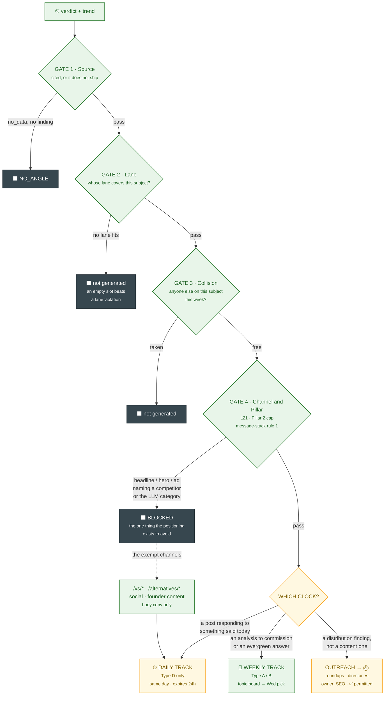
```mermaid
flowchart TD
    IN["⑤ verdict + trend"] --> G1{"GATE 1 · Source<br/><small>cited, or it does not ship</small>"}
    G1 -->|"no_data, no finding"| X1["⬛ NO_ANGLE"]
    G1 -->|"pass"| G2

    G2{"GATE 2 · Lane<br/><small>whose lane covers this subject?</small>"}
    G2 -->|"no lane fits"| X2["⬛ not generated<br/><small>an empty slot beats<br/>a lane violation</small>"]
    G2 -->|"pass"| G3

    G3{"GATE 3 · Collision<br/><small>anyone else on this subject<br/>this week?</small>"}
    G3 -->|"taken"| X3["⬛ not generated"]
    G3 -->|"free"| G4

    G4{"GATE 4 · Channel and Pillar<br/><small>L21 · Pillar 2 cap<br/>message-stack rule 1</small>"}
    G4 -->|"headline / hero / ad<br/>naming a competitor<br/>or the LLM category"| X4["⬛ BLOCKED<br/><small>the one thing the positioning<br/>exists to avoid</small>"]
    G4 -->|"pass"| ROUTE

    ROUTE{"WHICH CLOCK?"}
    ROUTE -->|"a post responding to<br/>something said today"| D["⏱ DAILY TRACK<br/><small>Type D only<br/>same day · expires 24h</small>"]
    ROUTE -->|"an analysis to commission<br/>or an evergreen answer"| W["📅 WEEKLY TRACK<br/><small>Type A / B<br/>topic board → Wed pick</small>"]
    ROUTE -->|"a distribution finding,<br/>not a content one"| O["OUTREACH → ㉑<br/><small>roundups · directories<br/>owner: SEO · ✅ permitted</small>"]

    X4 -.->|"the exempt channels"| EX["/vs/* · /alternatives/*<br/>social · founder content<br/><small>body copy only</small>"]
    EX --> D

    classDef joy fill:#e8f5e9,stroke:#2e7d32,stroke-width:1.5px,color:#1b5e20
    classDef new fill:#fff8e1,stroke:#f9a825,stroke-width:1.5px,color:#7f5f00
    classDef stop fill:#37474f,stroke:#263238,stroke-width:1.5px,color:#ffffff
    class IN,G1,G2,G3,G4,W,EX joy
    class ROUTE,D,O new
    class X1,X2,X3,X4 stop
```

> **Case B in the example is a Gate 4 case.** The highest-velocity trend the engine will see is the one that
> must not become a headline — so it routes to outreach and to a founder post, never to a blog.

---

## 4 · ⑨⑩⑪⑫ Make — and the four ways the model refuses

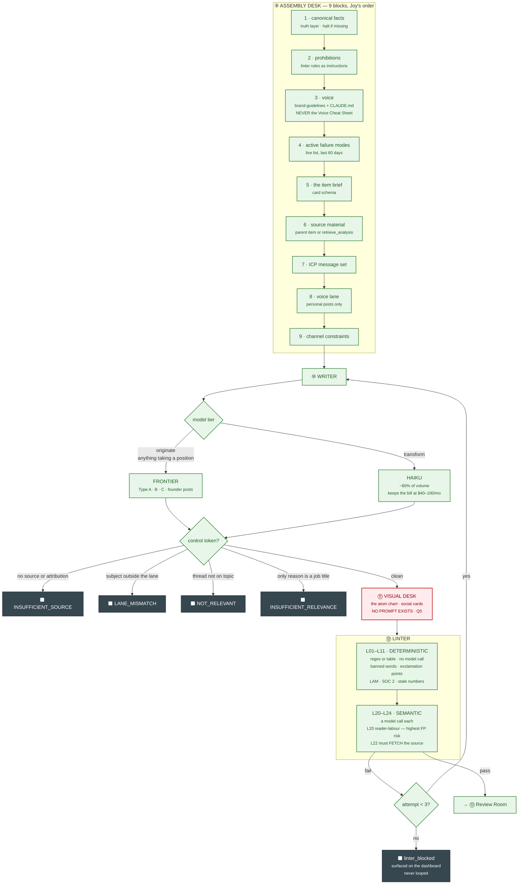
```mermaid
flowchart TD
    subgraph ASM["⑨ ASSEMBLY DESK — 9 blocks, Joy's order"]
        direction TB
        B1["1 · canonical facts<br/><small>truth layer · halt if missing</small>"]
        B2["2 · prohibitions<br/><small>linter rules as instructions</small>"]
        B3["3 · voice<br/><small>brand-guidelines + CLAUDE.md<br/>NEVER the Voice Cheat Sheet</small>"]
        B4["4 · active failure modes<br/><small>live list, last 60 days</small>"]
        B5["5 · the item brief<br/><small>card schema</small>"]
        B6["6 · source material<br/><small>parent item or retrieve_analysis</small>"]
        B7["7 · ICP message set"]
        B8["8 · voice lane<br/><small>personal posts only</small>"]
        B9["9 · channel constraints"]
        B1 --> B2 --> B3 --> B4 --> B5 --> B6 --> B7 --> B8 --> B9
    end

    B9 --> W["⑩ WRITER"]
    W --> TIER{"model tier"}
    TIER -->|"originate<br/>anything taking a position"| FR["FRONTIER<br/><small>Type A · B · C · founder posts</small>"]
    TIER -->|"transform"| HK["HAIKU<br/><small>~80% of volume<br/>keeps the bill at $40–100/mo</small>"]

    FR --> TOK
    HK --> TOK
    TOK{"control token?"}
    TOK -->|"no source or attribution"| T1["⬛ INSUFFICIENT_SOURCE"]
    TOK -->|"subject outside the lane"| T2["⬛ LANE_MISMATCH"]
    TOK -->|"thread not on topic"| T3["⬛ NOT_RELEVANT"]
    TOK -->|"only reason is a job title"| T4["⬛ INSUFFICIENT_RELEVANCE"]
    TOK -->|"clean"| VIS

    VIS["⑪ VISUAL DESK<br/><small>the atom chart · social cards<br/>NO PROMPT EXISTS · Q5</small>"]
    VIS --> LINT

    subgraph LINT["⑫ LINTER"]
        direction TB
        DET["L01–L11 · DETERMINISTIC<br/><small>regex or table · no model call<br/>banned words · exclamation points<br/>LAM · SOC 2 · stale numbers</small>"]
        SEM["L20–L24 · SEMANTIC<br/><small>a model call each<br/>L20 reader-labour — highest FP risk<br/>L22 must FETCH the source</small>"]
        DET --> SEM
    end

    SEM -->|"fail"| RG{"attempt &lt; 3?"}
    RG -->|"yes"| W
    RG -->|"no"| BL["⬛ linter_blocked<br/><small>surfaced on the dashboard<br/>never looped</small>"]
    SEM -->|"pass"| OUT["→ ⑬ Review Room"]

    classDef joy fill:#e8f5e9,stroke:#2e7d32,stroke-width:1.5px,color:#1b5e20
    classDef gap fill:#ffebee,stroke:#c62828,stroke-width:2px,color:#8e0000
    classDef stop fill:#37474f,stroke:#263238,stroke-width:1.5px,color:#ffffff
    class B1,B2,B3,B4,B5,B6,B7,B8,B9,W,TIER,FR,HK,TOK,DET,SEM,RG,OUT joy
    class VIS gap
    class T1,T2,T3,T4,BL stop
```

> **A control token is a success, not an error. It is never retried.** *"The generator refusing is cheaper than
> the linter rejecting, and far cheaper than a reviewer approving something unsourced on a Friday."*

---

## 5 · ⑬⑭ Review and the loop that compounds

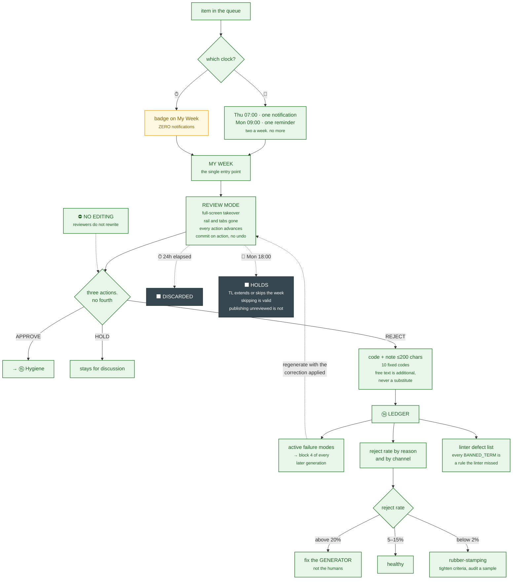
```mermaid
flowchart TD
    Q["item in the queue"] --> ENTRY{"which clock?"}
    ENTRY -->|"📅"| N1["Thu 07:00 · one notification<br/>Mon 09:00 · one reminder<br/><small>two a week. no more</small>"]
    ENTRY -->|"⏱"| N2["badge on My Week<br/><small>ZERO notifications</small>"]

    N1 --> MW["MY WEEK<br/><small>the single entry point</small>"]
    N2 --> MW
    MW --> RM["REVIEW MODE<br/><small>full-screen takeover<br/>rail and tabs gone<br/>every action advances<br/>commit on action, no undo</small>"]

    RM --> ACT{"three actions.<br/>no fourth"}
    ACT -->|"APPROVE"| AP["→ ⑮ Hygiene"]
    ACT -->|"HOLD"| HD["stays for discussion"]
    ACT -->|"REJECT"| RJ

    RJ["code + note ≤200 chars<br/><small>10 fixed codes<br/>free text is additional,<br/>never a substitute</small>"]
    RJ --> LG["⑭ LEDGER"]

    LG --> M1["active failure modes<br/><small>→ block 4 of every<br/>later generation</small>"]
    LG --> M2["reject rate by reason<br/>and by channel"]
    LG --> M3["linter defect list<br/><small>every BANNED_TERM is<br/>a rule the linter missed</small>"]

    M1 -.->|"regenerate with the<br/>correction applied"| RM
    M2 --> HEALTH{"reject rate"}
    HEALTH -->|"above 20%"| H1["fix the GENERATOR<br/><small>not the humans</small>"]
    HEALTH -->|"5–15%"| H2["healthy"]
    HEALTH -->|"below 2%"| H3["rubber-stamping<br/><small>tighten criteria, audit a sample</small>"]

    RM -.->|"⏱ 24h elapsed"| EX["⬛ DISCARDED"]
    RM -.->|"📅 Mon 18:00"| HO["⬛ HOLDS<br/><small>TL extends or skips the week<br/>skipping is valid<br/>publishing unreviewed is not</small>"]

    NOEDIT["⛔ NO EDITING<br/><small>reviewers do not rewrite</small>"] -.-> ACT

    classDef joy fill:#e8f5e9,stroke:#2e7d32,stroke-width:1.5px,color:#1b5e20
    classDef new fill:#fff8e1,stroke:#f9a825,stroke-width:1.5px,color:#7f5f00
    classDef stop fill:#37474f,stroke:#263238,stroke-width:1.5px,color:#ffffff
    class Q,ENTRY,N1,MW,RM,ACT,AP,HD,RJ,LG,M1,M2,M3,HEALTH,H1,H2,H3,NOEDIT joy
    class N2 new
    class EX,HO stop
```

---

## 6 · ⑮⑯ Hygiene and publish — the branch that is a compliance boundary

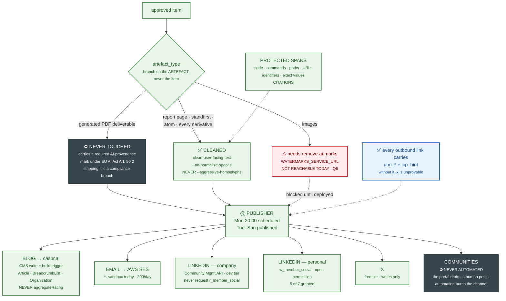
```mermaid
flowchart TD
    AP["approved item"] --> BR{"artefact_type<br/><small>branch on the ARTEFACT,<br/>never the item</small>"}

    BR -->|"generated PDF deliverable"| PDF["⛔ NEVER TOUCHED<br/><small>carries a required AI-provenance<br/>mark under EU AI Act Art. 50 2<br/>stripping it is a compliance breach</small>"]
    BR -->|"report page · standfirst ·<br/>atom · every derivative"| PROSE["✅ CLEANED<br/><small>clean-user-facing-text<br/>--no-normalize-spaces<br/>NEVER --aggressive-homoglyphs</small>"]
    BR -->|"images"| IMG["⚠ needs remove-ai-marks<br/><small>WATERMARKS_SERVICE_URL<br/>NOT REACHABLE TODAY · Q6</small>"]

    PROT["PROTECTED SPANS<br/><small>code · commands · paths · URLs<br/>identifiers · exact values<br/>CITATIONS</small>"] -.-> PROSE

    PDF --> PUB
    PROSE --> PUB
    IMG -.->|"blocked until deployed"| PUB

    PUB["⑯ PUBLISHER<br/>Mon 20:00 scheduled<br/>Tue–Sun published"]

    PUB --> CH1["BLOG → caspr.ai<br/><small>CMS write + build trigger<br/>Article · BreadcrumbList · Organization<br/>NEVER aggregateRating</small>"]
    PUB --> CH2["EMAIL → AWS SES<br/><small>⚠ sandbox today · 200/day</small>"]
    PUB --> CH3["LINKEDIN — company<br/><small>Community Mgmt API · dev tier<br/>never request r_member_social</small>"]
    PUB --> CH4["LINKEDIN — personal<br/><small>w_member_social · open permission<br/>5 of 7 granted</small>"]
    PUB --> CH5["X<br/><small>free tier · writes only</small>"]
    PUB --> CH6["COMMUNITIES<br/><small>⛔ NEVER AUTOMATED<br/>the portal drafts. a human posts.<br/>automation burns the channel</small>"]

    STAMP["✅ every outbound link carries<br/>utm_* + icp_hint<br/><small>without it, x is unprovable</small>"] -.-> PUB

    classDef joy fill:#e8f5e9,stroke:#2e7d32,stroke-width:1.5px,color:#1b5e20
    classDef gap fill:#ffebee,stroke:#c62828,stroke-width:2px,color:#8e0000
    classDef stop fill:#37474f,stroke:#263238,stroke-width:1.5px,color:#ffffff
    classDef good fill:#e3f2fd,stroke:#1565c0,stroke-width:2px,color:#0d47a1
    class AP,BR,PROSE,PROT,PUB,CH1,CH2,CH3,CH4,CH5 joy
    class IMG gap
    class PDF,CH6 stop
    class STAMP good
```

---

## 7 · The fan-out — one analysis becomes 16–23 items

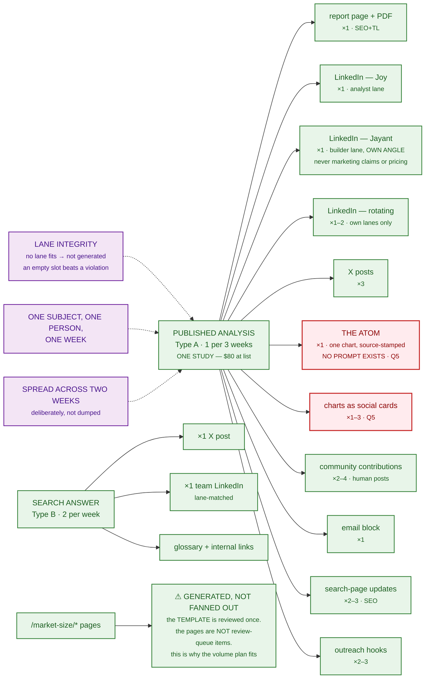
```mermaid
flowchart LR
    A["PUBLISHED ANALYSIS<br/>Type A · 1 per 3 weeks<br/><small>ONE STUDY — $80 at list</small>"]

    A --> I1["report page + PDF<br/><small>×1 · SEO+TL</small>"]
    A --> I2["LinkedIn — Joy<br/><small>×1 · analyst lane</small>"]
    A --> I3["LinkedIn — Jayant<br/><small>×1 · builder lane, OWN ANGLE<br/>never marketing claims or pricing</small>"]
    A --> I4["LinkedIn — rotating<br/><small>×1–2 · own lanes only</small>"]
    A --> I5["X posts<br/><small>×3</small>"]
    A --> I6["THE ATOM<br/><small>×1 · one chart, source-stamped<br/>NO PROMPT EXISTS · Q5</small>"]
    A --> I7["charts as social cards<br/><small>×1–3 · Q5</small>"]
    A --> I8["community contributions<br/><small>×2–4 · human posts</small>"]
    A --> I9["email block<br/><small>×1</small>"]
    A --> I10["search-page updates<br/><small>×2–3 · SEO</small>"]
    A --> I11["outreach hooks<br/><small>×2–3</small>"]

    R1["LANE INTEGRITY<br/><small>no lane fits → not generated<br/>an empty slot beats a violation</small>"] -.-> A
    R2["ONE SUBJECT, ONE PERSON,<br/>ONE WEEK"] -.-> A
    R3["SPREAD ACROSS TWO WEEKS<br/><small>deliberately, not dumped</small>"] -.-> A

    B["SEARCH ANSWER<br/>Type B · 2 per week"] --> J1["×1 X post"]
    B --> J2["×1 team LinkedIn<br/><small>lane-matched</small>"]
    B --> J3["glossary + internal links"]

    MS["/market-size/* pages"] --> MSN["⚠ GENERATED, NOT FANNED OUT<br/><small>the TEMPLATE is reviewed once.<br/>the pages are NOT review-queue items.<br/>this is why the volume plan fits</small>"]

    classDef joy fill:#e8f5e9,stroke:#2e7d32,stroke-width:1.5px,color:#1b5e20
    classDef gap fill:#ffebee,stroke:#c62828,stroke-width:2px,color:#8e0000
    classDef rule fill:#f3e5f5,stroke:#6a1b9a,stroke-width:1.5px,color:#4a148c
    class A,I1,I2,I3,I4,I5,I8,I9,I10,I11,B,J1,J2,J3,MS,MSN joy
    class I6,I7 gap
    class R1,R2,R3 rule
```

---

## 8 · ⑱ How it all reaches `x`

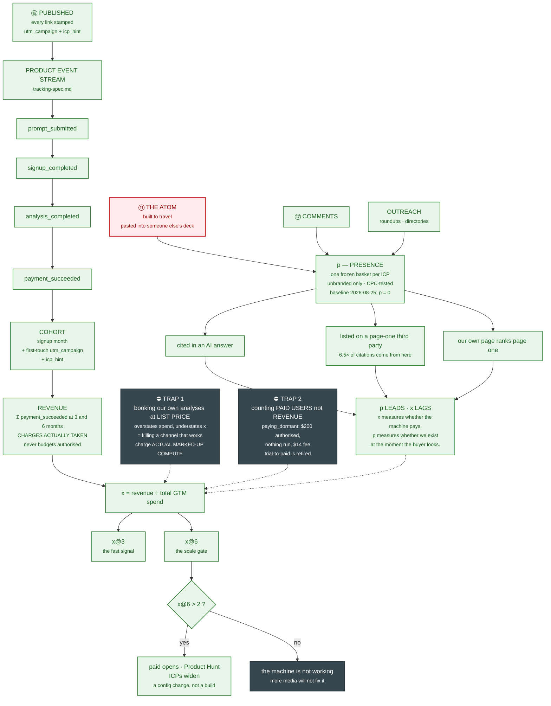
```mermaid
flowchart TD
    P["⑯ PUBLISHED<br/><small>every link stamped<br/>utm_campaign + icp_hint</small>"]
    P --> ES["PRODUCT EVENT STREAM<br/><small>tracking-spec.md</small>"]
    ES --> E1["prompt_submitted"] --> E2["signup_completed"] --> E3["analysis_completed"] --> E4["payment_succeeded"]
    E4 --> CO["COHORT<br/><small>signup month<br/>+ first-touch utm_campaign<br/>+ icp_hint</small>"]
    CO --> REV["REVENUE<br/><small>Σ payment_succeeded at 3 and 6 months<br/>CHARGES ACTUALLY TAKEN<br/>never budgets authorised</small>"]
    REV --> X["x = revenue ÷ total GTM spend"]
    X --> X3["x@3<br/><small>the fast signal</small>"]
    X --> X6["x@6<br/><small>the scale gate</small>"]
    X6 --> GATE{"x@6 &gt; 2 ?"}
    GATE -->|"yes"| SCALE["paid opens · Product Hunt<br/>ICPs widen<br/><small>a config change, not a build</small>"]
    GATE -->|"no"| KILL["the machine is not working<br/><small>more media will not fix it</small>"]

    T1["⛔ TRAP 1<br/>booking our own analyses at LIST PRICE<br/><small>overstates spend, understates x<br/>= killing a channel that works<br/>charge ACTUAL MARKED-UP COMPUTE</small>"] -.-> X
    T2["⛔ TRAP 2<br/>counting PAID USERS not REVENUE<br/><small>paying_dormant: $200 authorised,<br/>nothing run, $14 fee<br/>trial-to-paid is retired</small>"] -.-> X

    ATOM["⑪ THE ATOM<br/><small>built to travel<br/>pasted into someone else's deck</small>"] --> PP
    S17["⑰ COMMENTS"] --> PP
    OUT["OUTREACH<br/><small>roundups · directories</small>"] --> PP
    PP["p — PRESENCE<br/><small>one frozen basket per ICP<br/>unbranded only · CPC-tested<br/>baseline 2026-08-25: p = 0</small>"]
    PP --> W1["cited in an AI answer"]
    PP --> W2["listed on a page-one third party<br/><small>6.5× of citations come from here</small>"]
    PP --> W3["our own page ranks page one"]
    W1 --> LEAD["p LEADS · x LAGS<br/><small>x measures whether the machine pays.<br/>p measures whether we exist<br/>at the moment the buyer looks.</small>"]
    W2 --> LEAD
    W3 --> LEAD
    LEAD -.-> X

    classDef joy fill:#e8f5e9,stroke:#2e7d32,stroke-width:1.5px,color:#1b5e20
    classDef gap fill:#ffebee,stroke:#c62828,stroke-width:2px,color:#8e0000
    classDef stop fill:#37474f,stroke:#263238,stroke-width:1.5px,color:#ffffff
    classDef good fill:#e3f2fd,stroke:#1565c0,stroke-width:2px,color:#0d47a1
    class P,ES,E1,E2,E3,E4,CO,REV,X,X3,X6,GATE,SCALE,S17,OUT,PP,W1,W2,W3,LEAD joy
    class ATOM gap
    class T1,T2,KILL stop
```

---

## 9 · Who does what — the swimlane

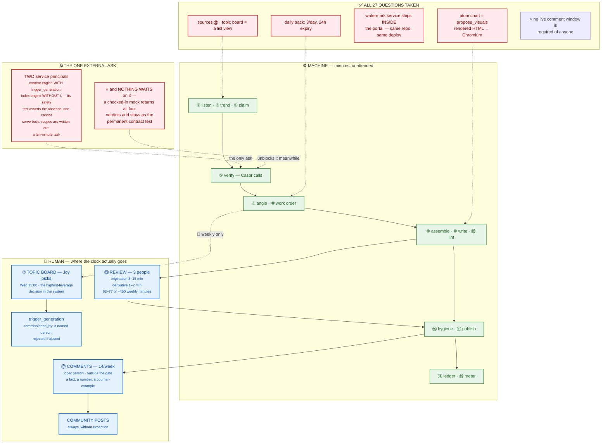
```mermaid
flowchart TD
    subgraph MACHINE["⚙ MACHINE — minutes, unattended"]
        M1["② listen · ③ trend · ④ claim"]
        M2["⑤ verify — Caspr calls"]
        M3["⑥ angle · ⑧ work order"]
        M4["⑨ assemble · ⑩ write · ⑫ lint"]
        M5["⑮ hygiene · ⑯ publish"]
        M6["⑭ ledger · ⑱ meter"]
    end

    subgraph HUMAN["👤 HUMAN — where the clock actually goes"]
        H1["⑦ TOPIC BOARD — Joy picks<br/><small>Wed 15:00 · the highest-leverage<br/>decision in the system</small>"]
        H2["trigger_generation<br/><small>commissioned_by: a named person.<br/>rejected if absent</small>"]
        H3["⑬ REVIEW — 3 people<br/><small>origination 8–15 min<br/>derivative 1–2 min<br/>62–77 of ~450 weekly minutes</small>"]
        H4["⑰ COMMENTS — 14/week<br/><small>2 per person · outside the gate<br/>a fact, a number, a counter-example</small>"]
        H5["COMMUNITY POSTS<br/><small>always, without exception</small>"]
    end

    subgraph JAYANT["🔒 THE ONE EXTERNAL ASK"]
        B1["TWO service principals<br/><small>content engine WITH trigger_generation,<br/>index engine WITHOUT it — its safety<br/>test asserts the absence. one cannot<br/>serve both. scopes are written out:<br/>a ten-minute task</small>"]
        B2["⭐ and NOTHING WAITS on it —<br/>a checked-in mock returns all four<br/>verdicts and stays as the<br/>permanent contract test"]
    end

    subgraph DECIDE["✅ ALL 27 QUESTIONS TAKEN"]
        D1["sources ㉓ · topic board = a list view"]
        D3["atom chart = propose_visuals<br/>rendered HTML → Chromium"]
        D4["watermark service ships INSIDE<br/>the portal — same repo, same deploy"]
        D5["daily track: 3/day, 24h expiry"]
        D6["⭐ no live comment window is<br/>required of anyone"]
    end

    M1 --> M2 --> M3 --> M4 --> M5
    M3 -.->|"📅 weekly only"| H1
    H1 --> H2
    M4 --> H3 --> M5
    M5 --> H4 --> H5
    M5 --> M6

    B1 -.->|"the only ask"| M2
    B2 -.->|"unblocks it meanwhile"| M2
    D1 -.-> M1
    D3 -.-> M4
    D5 -.-> M3

    classDef mach fill:#e8f5e9,stroke:#2e7d32,stroke-width:1.5px,color:#1b5e20
    classDef hum fill:#e3f2fd,stroke:#1565c0,stroke-width:2px,color:#0d47a1
    classDef blk fill:#ffebee,stroke:#c62828,stroke-width:2px,color:#8e0000
    class M1,M2,M3,M4,M5,M6 mach
    class H1,H2,H3,H4,H5 hum
    class B1,B2,D1,D2,D3,D4,D5 blk
```

---

## 9A · ⑲ ⑳ ㉑ ㉒ — the four that sit across the line

**Runtime spec §7A.** None of these four produces a content item, which is why a diagram drawn as a line
loses them. Drawn here by what they read and what they feed.

### 9A.1 · ⑲ The Truth Layer — one table, two consumers, one loop back

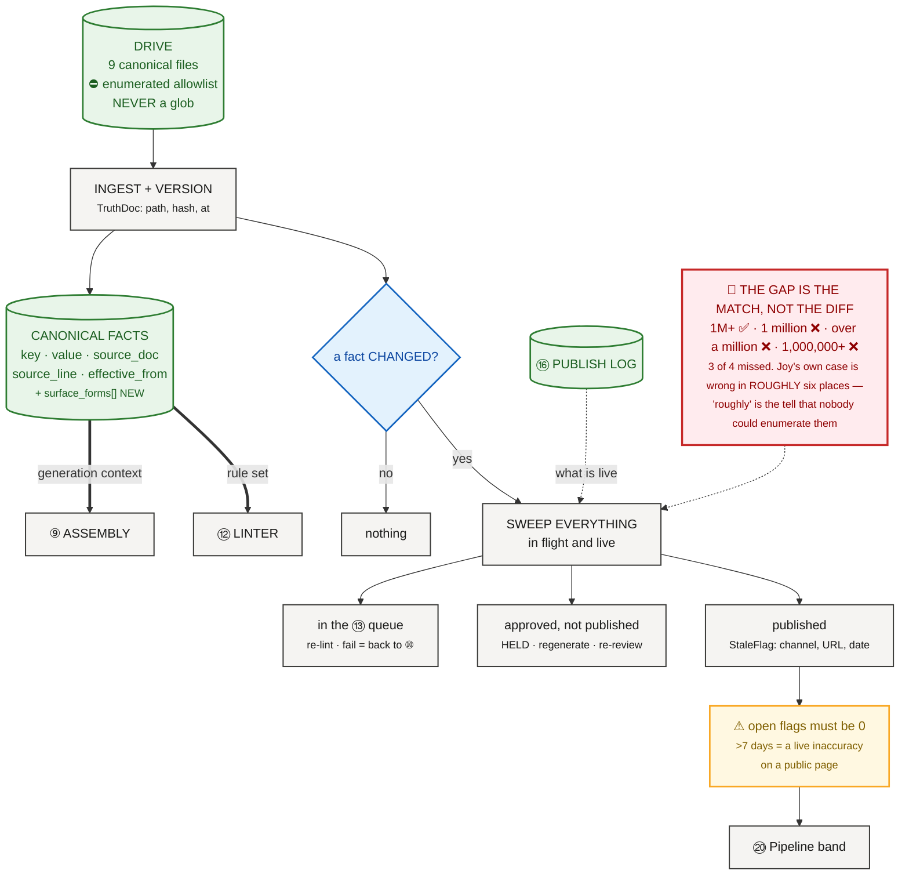
```mermaid
flowchart TD
    DRIVE[("DRIVE<br/>9 canonical files<br/>⛔ enumerated allowlist<br/>NEVER a glob")]
    ING["INGEST + VERSION<br/><small>TruthDoc: path, hash, at</small>"]
    FACTS[("CANONICAL FACTS<br/>key · value · source_doc<br/>source_line · effective_from<br/><small>+ surface_forms[] NEW</small>")]

    DRIVE --> ING --> FACTS

    FACTS ==>|"generation context"| S9["⑨ ASSEMBLY"]
    FACTS ==>|"rule set"| S12["⑫ LINTER"]

    ING --> DIFF{"a fact CHANGED?"}
    DIFF -->|no| IDLE["nothing"]
    DIFF -->|yes| SWEEP["SWEEP EVERYTHING<br/>in flight and live"]

    SWEEP --> Q["in the ⑬ queue<br/><small>re-lint · fail = back to ⑩</small>"]
    SWEEP --> AP["approved, not published<br/><small>HELD · regenerate · re-review</small>"]
    SWEEP --> PUB["published<br/><small>StaleFlag: channel, URL, date</small>"]

    PUB --> HEALTH["⚠ open flags must be 0<br/><small>>7 days = a live inaccuracy<br/>on a public page</small>"]
    HEALTH --> DASH["⑳ Pipeline band"]

    S16[("⑯ PUBLISH LOG")] -.->|"what is live"| SWEEP

    GAP["🔴 THE GAP IS THE MATCH, NOT THE DIFF<br/>1M+ ✅ · 1 million ❌ · over a million ❌ · 1,000,000+ ❌<br/><small>3 of 4 missed. Joy's own case is wrong in ROUGHLY six places —<br/>'roughly' is the tell that nobody could enumerate them</small>"]
    GAP -.-> SWEEP

    classDef src fill:#e8f5e9,stroke:#2e7d32,stroke-width:2px,color:#1b5e20
    classDef mach fill:#f5f4f2,stroke:#3c3c3a,stroke-width:1.5px,color:#1a1a19
    classDef dec fill:#e3f2fd,stroke:#1565c0,stroke-width:2px,color:#0d47a1
    classDef warn fill:#fff8e1,stroke:#f9a825,stroke-width:2px,color:#7f5f00
    classDef gap fill:#ffebee,stroke:#c62828,stroke-width:2.5px,color:#8e0000
    class DRIVE,FACTS,S16 src
    class ING,SWEEP,Q,AP,PUB,S9,S12,IDLE,DASH mach
    class DIFF dec
    class HEALTH warn
    class GAP gap
```

**The one line to say:** *"The numbers in our content come from one table, and when a number in it moves,
every page carrying the old one raises a flag the same day. That is the module that stops `1M+ → 25M+` being
wrong in six places with nobody holding the list."*

---

### 9A.2 · ⑳ The Dashboard — four bands, and the failure mode is a zero

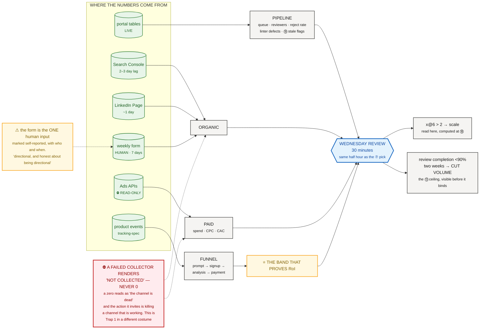
```mermaid
flowchart LR
    subgraph SRC["WHERE THE NUMBERS COME FROM"]
        OWN[("portal tables<br/><small>LIVE</small>")]
        GSC[("Search Console<br/><small>2–3 day lag</small>")]
        LI[("LinkedIn Page<br/><small>~1 day</small>")]
        FORM[("weekly form<br/><small>HUMAN · 7 days</small>")]
        ADS[("Ads APIs<br/><small>⛔ READ-ONLY</small>")]
        EV[("product events<br/><small>tracking-spec</small>")]
    end

    OWN --> B1["PIPELINE<br/><small>queue · reviewers · reject rate<br/>linter defects · ⑲ stale flags</small>"]
    GSC --> B2["ORGANIC"]
    LI --> B2
    FORM --> B2
    ADS --> B3["PAID<br/><small>spend · CPC · CAC</small>"]
    EV --> B4["FUNNEL<br/><small>prompt → signup →<br/>analysis → payment</small>"]

    B4 --> ROI["⭐ THE BAND THAT PROVES RoI"]

    B1 --> WED{{"WEDNESDAY REVIEW<br/>30 minutes<br/><small>same half hour as the ⑦ pick</small>"}}
    B2 --> WED
    B3 --> WED
    ROI --> WED

    WED --> GATE["x@6 > 2 → scale<br/><small>read here, computed at ⑱</small>"]
    WED --> CEIL["review completion <90%<br/>two weeks → CUT VOLUME<br/><small>the ⑬ ceiling, visible before it binds</small>"]

    NULL["⛔ A FAILED COLLECTOR RENDERS<br/>'NOT COLLECTED' — NEVER 0<br/><small>a zero reads as 'the channel is dead'<br/>and the action it invites is killing<br/>a channel that is working. This is<br/>Trap 1 in a different costume</small>"]
    NULL -.-> B2
    NULL -.-> B3

    SELF["⚠ the form is the ONE human input<br/><small>marked self-reported, with who and when.<br/>'directional, and honest about being directional'</small>"]
    SELF -.-> FORM

    classDef src fill:#e8f5e9,stroke:#2e7d32,stroke-width:1.5px,color:#1b5e20
    classDef band fill:#f5f4f2,stroke:#3c3c3a,stroke-width:1.5px,color:#1a1a19
    classDef hum fill:#e3f2fd,stroke:#1565c0,stroke-width:2.5px,color:#0d47a1
    classDef warn fill:#fff8e1,stroke:#f9a825,stroke-width:2px,color:#7f5f00
    classDef blk fill:#ffebee,stroke:#c62828,stroke-width:2.5px,color:#8e0000
    class OWN,GSC,LI,FORM,ADS,EV src
    class B1,B2,B3,B4,GATE,CEIL band
    class WED hum
    class ROI,SELF warn
    class NULL blk
```

**The one line to say:** *"One page, four bands, read for thirty minutes on a Wednesday. Every cell says when
it was last collected — and if a collector failed, it says so rather than showing a zero, because a zero is
how you kill a channel that is working."*

---

### 9A.3 · ㉑ The Outreach Desk — the portal drafts, a person sends

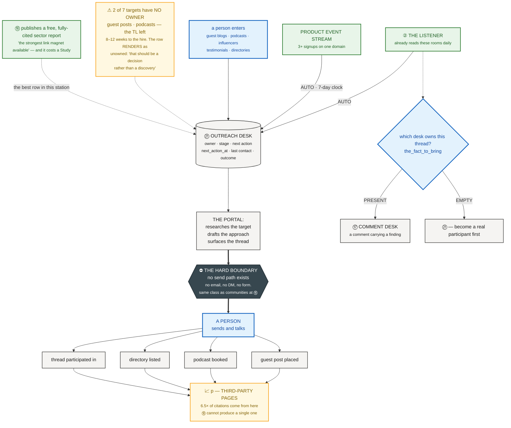
```mermaid
flowchart TD
    A1["② THE LISTENER<br/><small>already reads these rooms daily</small>"] -->|"AUTO"| DESK
    A2["PRODUCT EVENT STREAM<br/><small>3+ signups on one domain</small>"] -->|"AUTO · 7-day clock"| DESK
    A3["a person enters<br/><small>guest blogs · podcasts · influencers<br/>testimonials · directories</small>"] --> DESK

    DESK[("㉑ OUTREACH DESK<br/><small>owner · stage · next action<br/>next_action_at · last contact · outcome</small>")]

    DESK --> RES["THE PORTAL:<br/>researches the target<br/>drafts the approach<br/>surfaces the thread"]
    RES ==> LINE{{"⛔ THE HARD BOUNDARY<br/>no send path exists<br/><small>no email, no DM, no form.<br/>same class as communities at ⑯</small>"}}
    LINE ==> HUM["A PERSON<br/>sends and talks"]

    HUM --> OUT1["guest post placed"]
    HUM --> OUT2["podcast booked"]
    HUM --> OUT3["directory listed"]
    HUM --> OUT4["thread participated in"]

    OUT1 --> P["📈 p — THIRD-PARTY PAGES<br/><small>6.5× of citations come from here<br/>⑯ cannot produce a single one</small>"]
    OUT2 --> P
    OUT3 --> P
    OUT4 --> P

    SPLIT{"which desk owns this thread?<br/>the_fact_to_bring"}
    SPLIT -->|"PRESENT"| C17["⑰ COMMENT DESK<br/><small>a comment carrying a finding</small>"]
    SPLIT -->|"EMPTY"| DESK2["㉑ — become a real participant first"]
    A1 -.-> SPLIT

    UNOWNED["⚠ 2 of 7 targets have NO OWNER<br/>guest posts · podcasts — the TL left<br/><small>8–12 weeks to the hire. The row RENDERS as<br/>unowned: 'that should be a decision<br/>rather than a discovery'</small>"]
    UNOWNED -.-> DESK

    LOOP["⑯ publishes a free, fully-cited sector report<br/><small>'the strongest link magnet available' — and it costs a Study</small>"]
    LOOP -.->|"the best row in this station"| DESK

    classDef auto fill:#e8f5e9,stroke:#2e7d32,stroke-width:2px,color:#1b5e20
    classDef mach fill:#f5f4f2,stroke:#3c3c3a,stroke-width:1.5px,color:#1a1a19
    classDef hum fill:#e3f2fd,stroke:#1565c0,stroke-width:2.5px,color:#0d47a1
    classDef stop fill:#37474f,stroke:#263238,stroke-width:2px,color:#ffffff
    classDef warn fill:#fff8e1,stroke:#f9a825,stroke-width:2px,color:#7f5f00
    class A1,A2,LOOP auto
    class DESK,RES,OUT1,OUT2,OUT3,OUT4,DESK2,C17 mach
    class A3,HUM,SPLIT hum
    class LINE stop
    class UNOWNED,P warn
```

**The one line to say:** *"Relationships, tracked like a pipeline. The portal researches the target and writes
the approach — it never sends it. And this is the only part of the machine that gets us onto somebody else's
page, which is where two thirds of being found actually happens."*

---

### 9A.4 · ㉒ The Performance Desk — the loop that was missing

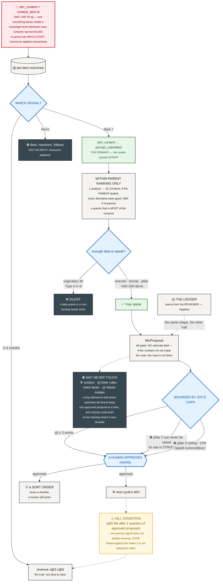
```mermaid
flowchart TD
    STAMP["🔴 utm_content = content_item.id<br/><small>ONE LINE IN ⑯ — and everything below needs it.<br/>Campaign-level attribution says 'LinkedIn earned $4,000'.<br/>It cannot say WHICH POST. Cannot be applied retroactively</small>"]

    STAMP --> EV[("⑱ per-item outcomes")]

    EV --> LADDER{"WHICH SIGNAL?"}
    LADDER -->|"3–6 months"| S1["revenue x@3 x@6<br/><small>the truth. too slow to steer</small>"]
    LADDER -->|"days ⭐"| S3["utm_content → prompt_submitted<br/><small>THE PRIMARY — the reader spends INTENT</small>"]
    LADDER -->|"hours"| S5["⛔ likes, reactions, follows<br/><small>NOT AN INPUT. measures applause</small>"]

    S3 --> PAR["WITHIN-PARENT RANKING ONLY<br/><small>1 analysis → 16–23 items. If the PARENT landed,<br/>every derivative looks good. With 3–6 parents<br/>a quarter that is MOST of the variance</small>"]

    PAR --> SCOPE{"enough data to speak?"}
    SCOPE -->|"channel · format · pillar<br/>~420–530 items"| OK["✅ may speak"]
    SCOPE -->|"origination 30<br/>Type A 3–6"| NO["❌ SILENT<br/><small>4 data points is a coin<br/>landing heads twice</small>"]

    OK --> PROP["MixProposal<br/><small>all typed. NO rationale field —<br/>if the numbers do not make<br/>the case, the case is not there</small>"]

    PROP --> BOUND{"BOUNDED BY JOY'S CAPS"}
    BOUND -->|"|Δ| ≤ 5 points"| HUM
    BOUND -->|"⛔ pillar 2 can never be raised<br/>its cap is STRUCTURAL"| HUM
    BOUND -->|"⛔ pillar 3 ceiling ~10%<br/>'speed commoditises'"| HUM

    HUM{{"A HUMAN APPROVES<br/>monthly"}}
    HUM -->|"approved"| S8["⑧ next cycle's MIX"]
    HUM -->|"approved"| S7["⑦ a SORT ORDER<br/><small>never a shortlist.<br/>a human still picks</small>"]

    NEVER["⛔ MAY NEVER TOUCH<br/>⑨ context · ⑫ linter rules · voice lanes · ⑭ failure modes<br/><small>a loop allowed to edit these optimises the brand away<br/>one approved proposal at a time, and nobody could point<br/>at the meeting where it was decided</small>"]
    PROP -.-> NEVER

    KILL["⚠ KILL CONDITION<br/>x@6 flat after 2 quarters of approved proposals<br/><small>→ the primary signal does not predict revenue. STOP.<br/>Tested against the metric it is not allowed to steer</small>"]
    S8 -.-> KILL
    KILL -.-> S1

    LEDGER["⑭ THE LEDGER<br/><small>learns from the REVIEWER — negative</small>"]
    LEDGER -.->|"the same shape, the other half"| PROP

    classDef gap fill:#ffebee,stroke:#c62828,stroke-width:2.5px,color:#8e0000
    classDef mach fill:#f5f4f2,stroke:#3c3c3a,stroke-width:1.5px,color:#1a1a19
    classDef hum fill:#e3f2fd,stroke:#1565c0,stroke-width:2.5px,color:#0d47a1
    classDef good fill:#e8f5e9,stroke:#2e7d32,stroke-width:2px,color:#1b5e20
    classDef stop fill:#37474f,stroke:#263238,stroke-width:2px,color:#ffffff
    classDef warn fill:#fff8e1,stroke:#f9a825,stroke-width:2px,color:#7f5f00
    class STAMP gap
    class EV,PAR,PROP,S1,S8,S7,LEDGER mach
    class LADDER,SCOPE,BOUND,HUM hum
    class S3,OK good
    class S5,NO,NEVER stop
    class KILL warn
```

**The one line to say:** *"Right now the machine learns from what a reviewer rejected — a list of mistakes not
to repeat. It never learns from what a reader actually opened. This closes that: once a month it says which
**kinds** of item earned, and proposes making more of them. It proposes — a person still approves — and it is
not allowed near the voice rules, because a loop that optimises those optimises the brand away."*

**And the number to say with it:** *"It costs one line today — tagging every link with the item's id. Skip it
and the first three months are unmeasurable, because you cannot go back and re-tag a link that is already in
somebody's feed."*

---

## 9B · ㉓–㉚ The operating model — sources, roster, placement, provenance

**Spec: [`content-engine-operating-model.md`](content-engine-operating-model.md).** Eight registers a human
owns, and rules the engine executes against them. None of them writes copy.

### 9B.1 · ㉓ Three kinds of source — and collapsing them is the mistake

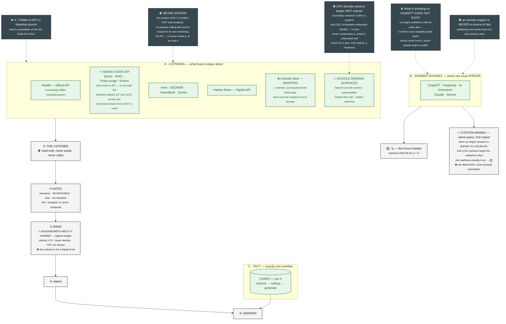
```mermaid
flowchart TD
    subgraph A["A · LISTENING — what buyers argue about"]
        R1["Reddit — official API<br/><small>r/consulting r/MBA r/marketresearch</small>"]
        R2["⭐ SEARCH-DATA API<br/>Quora · WSO · PrepLounge · forums<br/><small>they have no API — so we read the<br/>SEARCH INDEX OF THE SITE, not the site.<br/>a licensed results feed is NOT a crawl</small>"]
        R3["#mrx · ESOMAR · GreenBook · Quirks"]
        R4["Hacker News — Algolia API"]
        R5["❌ LinkedIn feed — DROPPED<br/><small>r_member_social poisons the whole app,<br/>and it was the weakest source anyway</small>"]
        R6["⭐ GOOGLE DEMAND SURFACES<br/><small>Search Console queries · autocomplete<br/>People Also Ask · related searches</small>"]
    end

    subgraph B["B · ANSWER ENGINES — where we must APPEAR"]
        P1["ChatGPT · Perplexity · AI Overviews<br/>Claude · Gemini"]
    end

    subgraph C["C · FACT — exactly one member"]
        C1[("CASPR — via ⑤<br/>retrieve → lookup → generate")]
    end

    A --> L["② THE LISTENER<br/>⛔ read-only. never posts, never votes"]
    L --> G["4 GATES<br/><small>relevance · SOURCEABLE · lane · not repeated<br/>fail = dropped, no score computed</small>"]
    G --> T["③ RANK<br/><small>⭐ DISAGREEMENT ABOUT A NUMBER — highest weight<br/>velocity >2.0 · buyer density · CPC not volume<br/>⛔ raw volume is not a signal at all</small>"]
    T --> CL["④ claims"] --> V["⑤ VERIFIER"]
    C1 --> V

    B --> PM["⑱ / p — the frozen basket<br/><small>baseline 2026-08-25: p = 0</small>"]
    B --> CITE["⭐ CITATION MINING — same query, 2nd output<br/><small>when an engine answers it SHOWS ITS SOURCES.<br/>that is the outreach target list, ranked by what<br/>the machines actually trust. → ㉑<br/>⛔ via official APIs. never browser automation</small>"]
    NOTREND["❌ 'what is trending on ChatGPT' DOES NOT EXIST<br/><small>no engine publishes what its users ask —<br/>it is their most valuable private asset.<br/>trends come from A, where people argue in public</small>"]
    NOTREND -.-> B

    XX["❌ X / Twitter is NOT a listening source<br/><small>read is unavailable at free tier. PUBLISH-ONLY</small>"]
    NOSCRAPE["⛔ NEVER SCRAPE<br/><small>the product claim is 'curated, NOT web scraping'.<br/>A company selling that cannot scrape for its own marketing.<br/>No API → a human reads it, or we skip it</small>"]
    BAD["⛔ an answer engine is NEVER a source of fact<br/><small>publishing one would invert our own product claim</small>"]
    CPC["⛔ CPC decides what to target, NOT volume<br/><small>'secondary research' at $9 is a student.<br/>and GSC is branded+unbranded MIXED — it must<br/>never contaminate p, which is unbranded and<br/>frozen for a year. GSC listens, p measures</small>"]
    CPC -.-> R6

    XX -.-> A
    NOSCRAPE -.-> A
    BAD -.-> B

    classDef src fill:#e8f5e9,stroke:#2e7d32,stroke-width:1.5px,color:#1b5e20
    classDef mach fill:#f5f4f2,stroke:#3c3c3a,stroke-width:1.5px,color:#1a1a19
    classDef stop fill:#37474f,stroke:#263238,stroke-width:2px,color:#ffffff
    classDef warn fill:#fff8e1,stroke:#f9a825,stroke-width:2px,color:#7f5f00
    class R1,R2,R3,R4,R5,R6,P1,C1 src
    class G,T mach
    class L,T,CL,V,PM,CITE mach
    class XX,NOSCRAPE,BAD,CPC,NOTREND stop
```

---

### 9B.1a · ⭐ The Quora flip — the question is theirs, the answer is ours

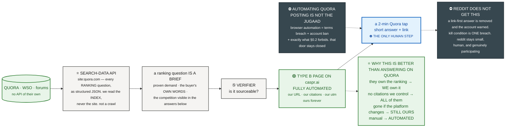
```mermaid
flowchart LR
    Q[("QUORA · WSO · forums<br/><small>no API of their own</small>")]
    Q --> API["⭐ SEARCH-DATA API<br/><small>site:quora.com — every RANKING question,<br/>as structured JSON. we read the INDEX,<br/>never the site. not a crawl</small>"]
    API --> BRIEF["a ranking question IS A BRIEF<br/><small>proven demand · the buyer's OWN WORDS ·<br/>the competition visible in the answers below</small>"]
    BRIEF --> V["⑤ VERIFIER<br/>is it sourceable?"]
    V --> PAGE["🟢 TYPE B PAGE ON caspr.ai<br/>FULLY AUTOMATED<br/><small>our URL · our citations · our utm<br/>ours forever</small>"]
    PAGE --> TAP["a 2-min Quora tap<br/>short answer + link<br/><small>⛔ THE ONLY HUMAN STEP</small>"]

    NO["⛔ AUTOMATING QUORA POSTING IS NOT THE JUGAAD<br/><small>browser automation = terms breach + account ban<br/>+ exactly what §0.2 forbids. that door stays closed</small>"]
    NO -.-> TAP

    WHY["⭐ WHY THIS IS BETTER THAN ANSWERING ON QUORA<br/>they own the ranking → WE own it<br/>no citations we control → ALL of them<br/>gone if the platform changes → STILL OURS<br/>manual → AUTOMATED"]
    PAGE -.-> WHY

    RED["⛔ REDDIT DOES NOT GET THIS<br/><small>a link-first answer is removed and the account warned.<br/>kill condition is ONE breach. reddit stays small,<br/>human, and genuinely participating</small>"]
    TAP -.-> RED

    classDef src fill:#e8f5e9,stroke:#2e7d32,stroke-width:2px,color:#1b5e20
    classDef mach fill:#f5f4f2,stroke:#3c3c3a,stroke-width:1.5px,color:#1a1a19
    classDef hum fill:#e3f2fd,stroke:#1565c0,stroke-width:2.5px,color:#0d47a1
    classDef stop fill:#37474f,stroke:#263238,stroke-width:2px,color:#ffffff
    class Q,PAGE,WHY src
    class API,BRIEF,V mach
    class TAP hum
    class NO,RED stop
```

**The one line to say:** *"We do not write on Quora. We use Quora to find out what people are actually asking,
and then we answer it on our own site — automatically, with citations. Quora gets a two-minute link."*

---

### 9B.1b · ⭐ The line — automated up to posting, then a human

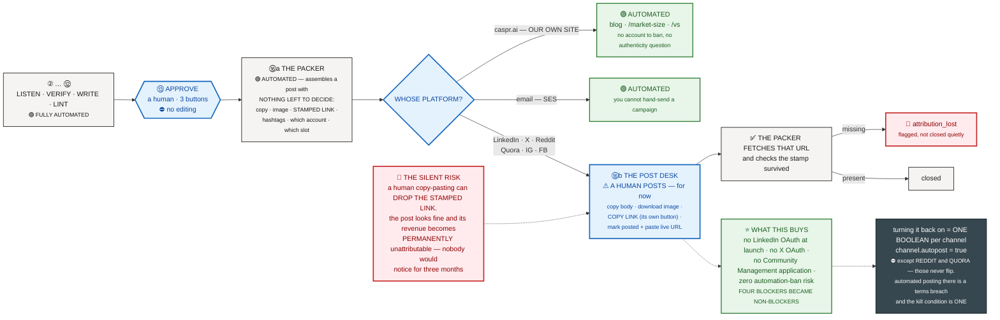
```mermaid
flowchart LR
    A["② … ⑫<br/>LISTEN · VERIFY · WRITE · LINT<br/><small>🟢 FULLY AUTOMATED</small>"]
    A --> R{{"⑬ APPROVE<br/>a human · 3 buttons<br/>⛔ no editing"}}
    R --> P["⑯a THE PACKER<br/><small>🟢 AUTOMATED — assembles a post with<br/>NOTHING LEFT TO DECIDE:<br/>copy · image · STAMPED LINK ·<br/>hashtags · which account · which slot</small>"]
    P --> SPLIT{"WHOSE PLATFORM?"}

    SPLIT -->|"caspr.ai — OUR OWN SITE"| AUTO1["🟢 AUTOMATED<br/>blog · /market-size · /vs<br/><small>no account to ban, no<br/>authenticity question</small>"]
    SPLIT -->|"email — SES"| AUTO2["🟢 AUTOMATED<br/><small>you cannot hand-send a campaign</small>"]
    SPLIT -->|"LinkedIn · X · Reddit<br/>Quora · IG · FB"| MAN["⑯b THE POST DESK<br/>⚠ A HUMAN POSTS — for now<br/><small>copy body · download image ·<br/>COPY LINK (its own button) ·<br/>mark posted + paste live URL</small>"]

    MAN --> CHECK["✅ THE PACKER FETCHES THAT URL<br/>and checks the stamp survived"]
    CHECK -->|"missing"| LOST["🔴 attribution_lost<br/><small>flagged, not closed quietly</small>"]
    CHECK -->|"present"| DONE["closed"]

    RISK["🔴 THE SILENT RISK<br/>a human copy-pasting can DROP THE STAMPED LINK.<br/>the post looks fine and its revenue becomes<br/>PERMANENTLY unattributable — nobody would<br/>notice for three months"]
    RISK -.-> MAN

    WIN["⭐ WHAT THIS BUYS<br/>no LinkedIn OAuth at launch · no X OAuth ·<br/>no Community Management application ·<br/>zero automation-ban risk<br/><small>FOUR BLOCKERS BECAME NON-BLOCKERS</small>"]
    MAN -.-> WIN

    FLAG["turning it back on = ONE BOOLEAN per channel<br/>channel.autopost = true<br/><small>⛔ except REDDIT and QUORA — those never flip.<br/>automated posting there is a terms breach<br/>and the kill condition is ONE</small>"]
    WIN -.-> FLAG

    classDef mach fill:#f5f4f2,stroke:#3c3c3a,stroke-width:1.5px,color:#1a1a19
    classDef hum fill:#e3f2fd,stroke:#1565c0,stroke-width:2.5px,color:#0d47a1
    classDef good fill:#e8f5e9,stroke:#2e7d32,stroke-width:2px,color:#1b5e20
    classDef gap fill:#ffebee,stroke:#c62828,stroke-width:2.5px,color:#8e0000
    classDef stop fill:#37474f,stroke:#263238,stroke-width:2px,color:#ffffff
    class A,P,CHECK,DONE mach
    class R,MAN,SPLIT hum
    class AUTO1,AUTO2,WIN good
    class RISK,LOST gap
    class FLAG stop
```

**The one line to say:** *"Everything up to the moment of posting is automated — the listening, the checking,
the writing, the image, the link. A person approves it, and for now a person posts it. Turning the posting on
later is a switch, not a rebuild."*

---

### 9B.2 · ㉖ Creation vs engagement — and who says what

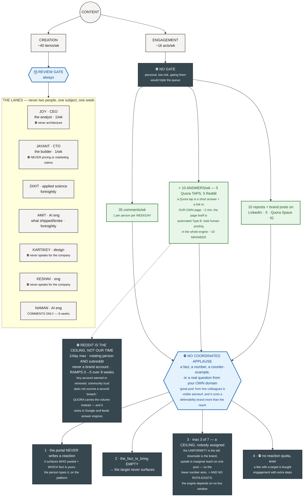
```mermaid
flowchart TD
    ENG(("CONTENT"))
    ENG --> CR["CREATION<br/>~40 items/wk"]
    ENG --> EG["ENGAGEMENT<br/>~16 acts/wk"]

    CR --> GATE{{"⑬ REVIEW GATE<br/>always"}}
    EG --> NOGATE["⛔ NO GATE<br/><small>personal, low-risk. gating them<br/>would triple the queue</small>"]

    GATE --> LANES

    subgraph LANES["THE LANES — never two people, one subject, one week"]
        J["JOY · CEO<br/>the analyst · 1/wk<br/><small>⛔ never architecture</small>"]
        JY["JAYANT · CTO<br/>the builder · 1/wk<br/><small>⛔ NEVER pricing or marketing claims</small>"]
        DX["DIXIT · applied science<br/>fortnightly"]
        AM["AMIT · AI eng<br/>what shipped/broke · fortnightly"]
        KT["KARTIKEY · design<br/><small>⛔ never speaks for the company</small>"]
        KS["KESHAV · eng<br/><small>⛔ never speaks for the company</small>"]
        NM["NAMAN · AI eng<br/><small>COMMENTS ONLY — 8 weeks</small>"]
    end

    NOGATE --> C1["35 comments/wk<br/><small>1 per person per WEEKDAY</small>"]
    NOGATE --> C2["⭐ 10 ANSWERS/wk — 5 Quora TAPS, 5 Reddit<br/><small>a Quora tap is a short answer + a link to<br/>OUR OWN page. ~2 min. the page itself is<br/>automated Type B. total human posting<br/>in the whole engine: ~10 MIN/WEEK</small>"]
    NOGATE --> C3["10 reposts + brand posts on<br/>LinkedIn · X · Quora Space · IG"]
    CAP["⛔ REDDIT IS THE CEILING, NOT OUR TIME<br/>1/day max · rotating person AND subreddit<br/>never a brand account · RAMPS 0→5 over 8 weeks<br/><small>'any account warned or removed. community trust<br/>does not survive a second breach.'<br/>QUORA carries the volume instead — and it<br/>ranks in Google and feeds answer engines</small>"]
    C2 -.-> CAP

    C1 --> RULE
    C2 --> RULE
    C3 --> RULE

    RULE{{"⛔ NO COORDINATED APPLAUSE<br/>a fact, a number, a counter-example,<br/>or a real question from your OWN domain<br/><small>'great post' from five colleagues is<br/>visible astroturf, and it costs a<br/>defensibility brand more than the reach</small>"}}

    RULE --> G1["1 · the portal NEVER writes a reaction<br/><small>it surfaces WHO posted + WHICH fact is yours.<br/>the person types it, on the platform</small>"]
    RULE --> G2["2 · the_fact_to_bring EMPTY<br/>→ the target never surfaces"]
    RULE --> G3["3 · max 3 of 7 — a CEILING, nobody assigned<br/><small>the UNIFORMITY is the tell. downside is the brand,<br/>upside is marginal reach on one post — so the<br/>lower number wins. ⭐ AND NO ROTA EXISTS:<br/>the engine depends on no live window</small>"]
    RULE --> G4["4 · ⛔ no reaction quota, ever<br/><small>a like with a target is bought<br/>engagement with extra steps</small>"]

    classDef mach fill:#f5f4f2,stroke:#3c3c3a,stroke-width:1.5px,color:#1a1a19
    classDef hum fill:#e3f2fd,stroke:#1565c0,stroke-width:2.5px,color:#0d47a1
    classDef stop fill:#37474f,stroke:#263238,stroke-width:2px,color:#ffffff
    classDef good fill:#e8f5e9,stroke:#2e7d32,stroke-width:2px,color:#1b5e20
    class ENG,CR,EG,J,JY,DX,AM,KT,KS,NM mach
    class GATE,RULE hum
    class NOGATE,G1,G2,G3,G4,CAP stop
    class C1,C2,C3 good
```

---

### 9B.3 · ㉔ ㉗ ㉘ Placement — what goes where, for whom, at what hour

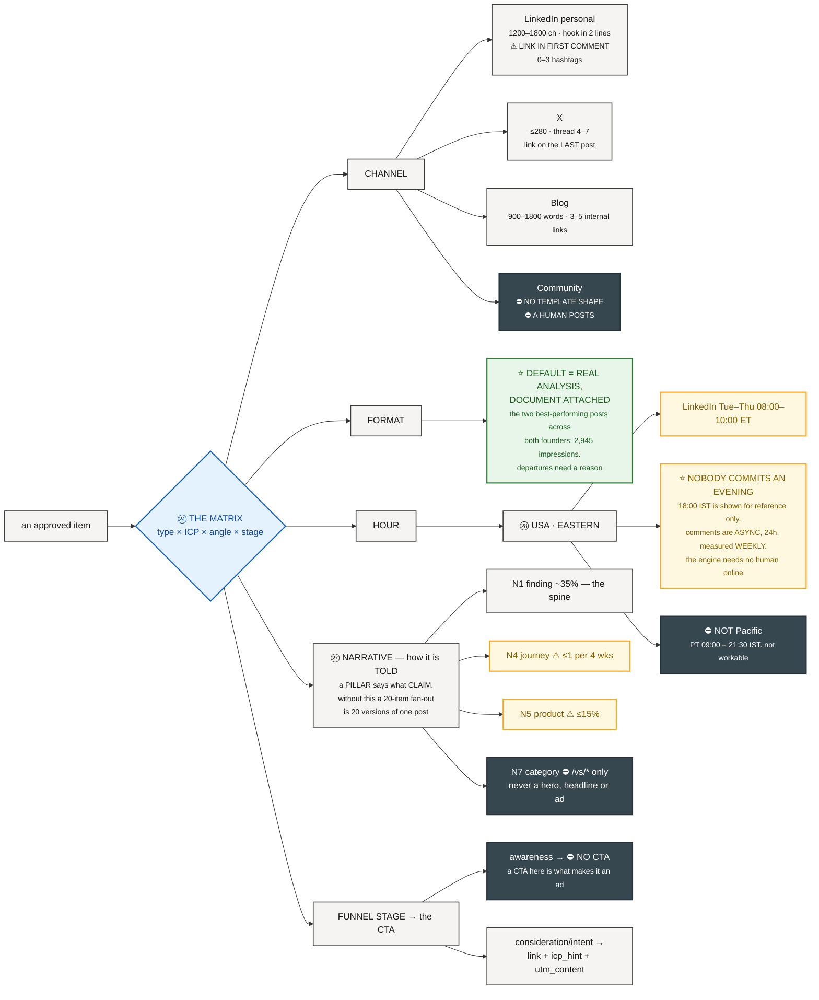
```mermaid
flowchart LR
    IT["an approved item"]
    IT --> M{"㉔ THE MATRIX<br/>type × ICP × angle × stage"}

    M --> CH["CHANNEL"]
    M --> FM["FORMAT"]
    M --> HR["HOUR"]

    CH --> C1["LinkedIn personal<br/><small>1200–1800 ch · hook in 2 lines<br/>⚠ LINK IN FIRST COMMENT<br/>0–3 hashtags</small>"]
    CH --> C2["X<br/><small>≤280 · thread 4–7<br/>link on the LAST post</small>"]
    CH --> C3["Blog<br/><small>900–1800 words · 3–5 internal links</small>"]
    CH --> C4["Community<br/><small>⛔ NO TEMPLATE SHAPE<br/>⛔ A HUMAN POSTS</small>"]

    FM --> EV["⭐ DEFAULT = REAL ANALYSIS,<br/>DOCUMENT ATTACHED<br/><small>the two best-performing posts across<br/>both founders. 2,945 impressions.<br/>departures need a reason</small>"]

    HR --> GEO["㉘ USA · EASTERN"]
    GEO --> H1["LinkedIn Tue–Thu 08:00–10:00 ET"]
    GEO --> H2["⭐ NOBODY COMMITS AN EVENING<br/><small>18:00 IST is shown for reference only.<br/>comments are ASYNC, 24h, measured WEEKLY.<br/>the engine needs no human online</small>"]
    GEO --> H3["⛔ NOT Pacific<br/><small>PT 09:00 = 21:30 IST. not workable</small>"]

    M --> NAR["㉗ NARRATIVE — how it is TOLD<br/><small>a PILLAR says what CLAIM.<br/>without this a 20-item fan-out<br/>is 20 versions of one post</small>"]
    NAR --> N1["N1 finding ~35% — the spine"]
    NAR --> N4["N4 journey ⚠ ≤1 per 4 wks"]
    NAR --> N5["N5 product ⚠ ≤15%"]
    NAR --> N7["N7 category ⛔ /vs/* only<br/>never a hero, headline or ad"]

    M --> ST["FUNNEL STAGE → the CTA"]
    ST --> S1["awareness → ⛔ NO CTA<br/><small>a CTA here is what makes it an ad</small>"]
    ST --> S2["consideration/intent →<br/>link + icp_hint + utm_content"]

    classDef mach fill:#f5f4f2,stroke:#3c3c3a,stroke-width:1.5px,color:#1a1a19
    classDef hum fill:#e3f2fd,stroke:#1565c0,stroke-width:2px,color:#0d47a1
    classDef warn fill:#fff8e1,stroke:#f9a825,stroke-width:2px,color:#7f5f00
    classDef stop fill:#37474f,stroke:#263238,stroke-width:2px,color:#ffffff
    classDef good fill:#e8f5e9,stroke:#2e7d32,stroke-width:2px,color:#1b5e20
    class IT,CH,FM,HR,C1,C2,C3,NAR,N1,ST,S2,GEO mach
    class M hum
    class H1,H2,N4,N5 warn
    class C4,H3,N7,S1 stop
    class EV good
```

---

### 9B.4 · ㉕ Whose posts we touch — four tiers, four permissions

```mermaid
flowchart TD
    F["② surfaces a post"] --> T{"㉕ WHICH TIER?"}

    T -->|"customers · partners<br/>people who cited us"| T1["TIER 1 · AMPLIFY<br/><small>repost WITH A LINE OF OUR OWN<br/>· comment · react</small>"]
    T -->|"practitioners in our ICPs<br/>trade press"| T2["TIER 2 · ENGAGE<br/><small>substantive comment only.<br/>⛔ no repost — we do not lend our<br/>feed to people we have no<br/>relationship with</small>"]
    T -->|"Bloomberg · FactSet · PitchBook<br/>Capital IQ · AlphaSense"| T3["TIER 3 · OBSERVE<br/>⛔ nothing visible<br/><small>these are the BUDGET LINE WE JOIN,<br/>not what we displace. commenting<br/>would frame it as the opposite</small>"]
    T -->|"ChatGPT — /vs/chatgpt exists"| T4["TIER 4 · READ ONLY<br/><small>membership grants NO action.<br/>a name enters when a /vs/ page<br/>is written, never before</small>"]

    T1 --> NB["⛔ never a BARE repost<br/><small>says nothing, earns nothing</small>"]

    T4 --> ONLY["THE ONE THING WE DO"]
    ONLY --> CLAIM["they stated a number → ④ it"]
    CLAIM --> VER["⑤ VERIFIER"]
    VER -->|"diverges"| OWN["our OWN sourced post<br/>⛔ WITHOUT NAMING THEM"]
    VER -->|"confirmed"| NOTHING["nothing. it was just true"]

    NEVER["⛔ NEVER: quote-post · dunk · 'actually…' in<br/>their replies · react · repost · name them in a headline<br/><small>naming them CONCEDES WE ARE IN THE SAME CATEGORY.<br/>'Your competitors are still waiting for the research'<br/>was RETIRED — speed-led and combative.<br/>The voice is calm authority, not rivalry</small>"]
    T4 --> NEVER

    HOME["✅ the ONE sanctioned home for direct contrast:<br/>/vs/* · /alternatives/* · social · founder content"]
    OWN -.-> HOME

    classDef mach fill:#f5f4f2,stroke:#3c3c3a,stroke-width:1.5px,color:#1a1a19
    classDef hum fill:#e3f2fd,stroke:#1565c0,stroke-width:2px,color:#0d47a1
    classDef stop fill:#37474f,stroke:#263238,stroke-width:2px,color:#ffffff
    classDef good fill:#e8f5e9,stroke:#2e7d32,stroke-width:2px,color:#1b5e20
    classDef warn fill:#fff8e1,stroke:#f9a825,stroke-width:2px,color:#7f5f00
    class F,CLAIM,VER,OWN,NOTHING,ONLY mach
    class T hum
    class T3,T4,NEVER,NB stop
    class T1,T2,HOME good
```

---

### 9B.5 · ㉙ The provenance check — two assertions, opposite directions

```mermaid
flowchart TD
    A["an approved artefact"] --> H["⑮ HYGIENE — strips"]
    H --> P{"㉙ WHAT IS THIS?<br/>branch on artefact_type"}

    P -->|"marketing asset<br/>card · hero · OG · ad"| M["ASSERT ABSENT<br/><small>no C2PA manifest<br/>no EXIF/XMP AI flag<br/>no zero-width / homoglyphs</small>"]
    P -->|"a Caspr PDF / PPTX<br/>WE SELL"| D["ASSERT PRESENT<br/><small>the Article 50 mark —<br/>visible on the cover AND<br/>machine-readable in XMP/OOXML</small>"]

    M -->|pass| PUB["⑯ PUBLISH"]
    D -->|pass| PUB
    M -->|fail| BLOCK["⛔ BLOCK"]
    D -->|fail| BREACH["⛔ BLOCK — COMPLIANCE BREACH<br/><small>EU AI Act Art. 50(2), in force 2 Aug 2026.<br/>Not a defect. A legal obligation</small>"]

    SVC{"WATERMARKS_SERVICE_URL<br/>reachable?"}
    M -.-> SVC
    SVC -->|"🔴 NO — today"| FAILCLOSED["FAIL CLOSED · HELD, NOT PUBLISHED<br/><small>an unreachable service returns nothing,<br/>which looks IDENTICAL to a clean file.<br/>'configured but unreachable' must never<br/>render as 'clean'</small>"]

    RULE["⭐ WE MARK WHAT WE SELL,<br/>AND WE CLEAN WHAT WE PUBLISH ABOUT OURSELVES<br/><small>the two rules point in opposite directions ON PURPOSE.<br/>a single 'strip everything' pass would satisfy<br/>the instruction and breach the Act</small>"]
    P -.-> RULE

    NOCLAIM["⛔ and it NEVER claims human authorship<br/><small>for a company selling 'cited, or it does not ship',<br/>claiming otherwise would be self-defeating</small>"]
    PUB -.-> NOCLAIM

    classDef mach fill:#f5f4f2,stroke:#3c3c3a,stroke-width:1.5px,color:#1a1a19
    classDef hum fill:#e3f2fd,stroke:#1565c0,stroke-width:2px,color:#0d47a1
    classDef stop fill:#37474f,stroke:#263238,stroke-width:2px,color:#ffffff
    classDef gap fill:#ffebee,stroke:#c62828,stroke-width:2.5px,color:#8e0000
    classDef good fill:#e8f5e9,stroke:#2e7d32,stroke-width:2px,color:#1b5e20
    class A,H,M,D,PUB mach
    class P,SVC hum
    class BLOCK,NOCLAIM stop
    class BREACH,FAILCLOSED gap
    class RULE good
```

---

## 10 · Build order

```mermaid
flowchart LR
    P0["PHASE 0<br/>⑲ truth layer — ingest only<br/><small>BLOCKED ON NOTHING<br/>⑨ context AND ⑫ rules are ONE table<br/>build it twice otherwise</small>"]
    P1["PHASE 1<br/>⑨ assembly · ⑩ writer<br/>⑫ linter · ⑭ ledger<br/><small>the data model falls out of ⑨</small>"]
    P2["PHASE 2<br/>⑧ work order · ⑬ review<br/><small>one item end to end<br/>against mocks</small>"]
    P3["PHASE 3<br/>⑮ hygiene · ⑯ publisher<br/><small>needs SES production + CMS write path.<br/>REQUEST SES DAY ONE — approval takes days</small>"]
    P4["PHASE 4<br/>⑤ verifier<br/><small>🔴 needs TWO SERVICE PRINCIPALS.<br/>builds against a CHECKED-IN MOCK that<br/>stays as the permanent contract test</small>"]
    P5["PHASE 5<br/>② ③ ④ ⑥ ⑦<br/><small>the intake half — ALL DECIDED<br/>sources ㉓ · topic board is a list view</small>"]
    P6["PHASE 6<br/>⑪ visual · ⑰ comments<br/><small>ALL DECIDED · propose_visuals + HTML/Chromium.<br/>watermark service ships INSIDE the portal</small>"]
    P6B["PHASE 6b<br/>⏱ daily track<br/><small>a trigger, a flag, a timer<br/>3/day cap · 24h expiry</small>"]
    P7["PHASE 7<br/>⑱ meter<br/><small>needs the app live</small>"]
    P3B["PHASE 3b<br/>⑲ stale detection<br/><small>needs ⑯ publish records.<br/>surface_forms confirmed once per fact.<br/>images REGENERATE, never text-diff</small>"]
    P5B["PHASE 5b<br/>㉑ outreach desk + ㉕ amplify<br/><small>its thread feed is ②<br/>stages decided · lapsed rows RENDER</small>"]
    P3C["PHASE 3c<br/>㉒ the stamp only<br/><small>utm_content = item id<br/>ONE LINE. must ship with<br/>the first publish or 3 months<br/>are unmeasurable</small>"]
    P8["PHASE 8<br/>㉒ performance desk<br/><small>first real proposal is WEEK 12.<br/>measurement runs from day one.<br/>±5 pts · min 12 items / 4 weeks</small>"]
    P7B["PHASE 7b<br/>⑳ dashboard<br/><small>FOUR bands. Funnel renders<br/>NOT COLLECTED until the stream is live</small>"]

    P0 --> P1 --> P2 --> P3 --> P3B --> P3C --> P4 --> P5 --> P5B --> P6 --> P6B --> P7 --> P7B --> P8

    START["⭐ START HERE — NOTHING IS WAITING<br/><small>all 27 questions are decided. ⑲ ingest first —<br/>half a day, and it is what ⑨ and ⑫ both read.<br/>then list every brace in ⑨ and name its source</small>"] --> P0

    classDef go fill:#e8f5e9,stroke:#2e7d32,stroke-width:2px,color:#1b5e20
    classDef wait fill:#fff8e1,stroke:#f9a825,stroke-width:1.5px,color:#7f5f00
    classDef start fill:#e3f2fd,stroke:#1565c0,stroke-width:2.5px,color:#0d47a1
    class P0,P1,P2,P3C,P5,P5B,P6,P6B,P8,P7B,P3B go
    class P3,P4,P7 wait
    class START start
```

---

*Document: `content-engine-flowchart.md` · 2026-09-08, §9A added 2026-09-09, §9A.4 and §9B 2026-09-10, decisions folded in the same day · The diagrams for
[`content-engine-runtime-spec.md`](content-engine-runtime-spec.md). **This file holds no rules.** Where a
diagram and the spec disagree, the spec is correct and the diagram is a bug — report it rather than following
it. Worked examples: [`content-engine-example.md`](content-engine-example.md).*
