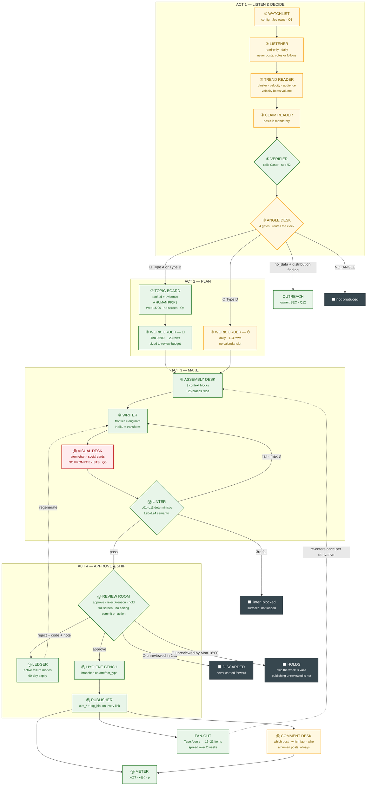
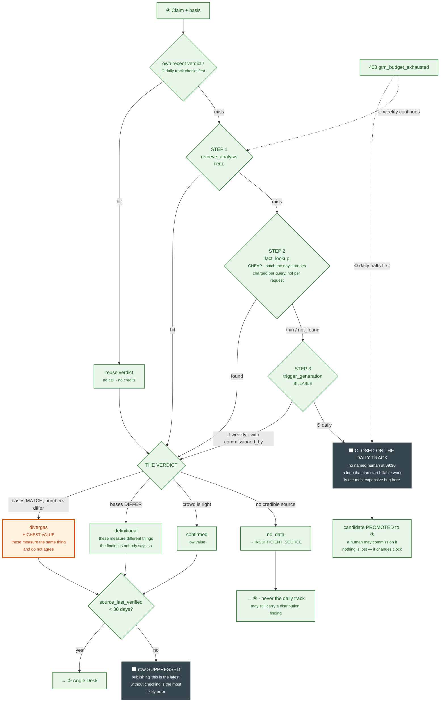
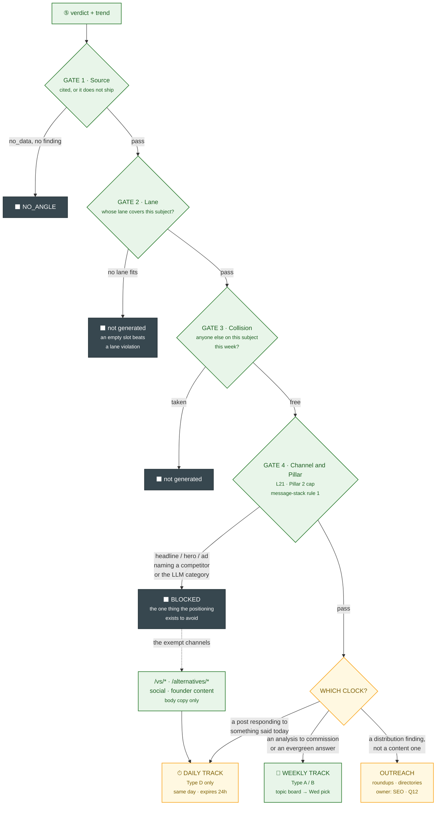
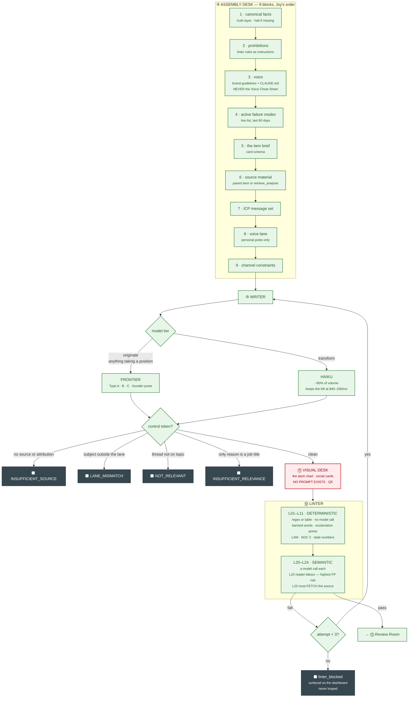
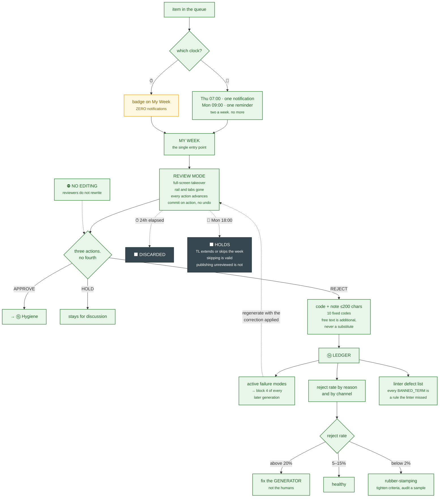
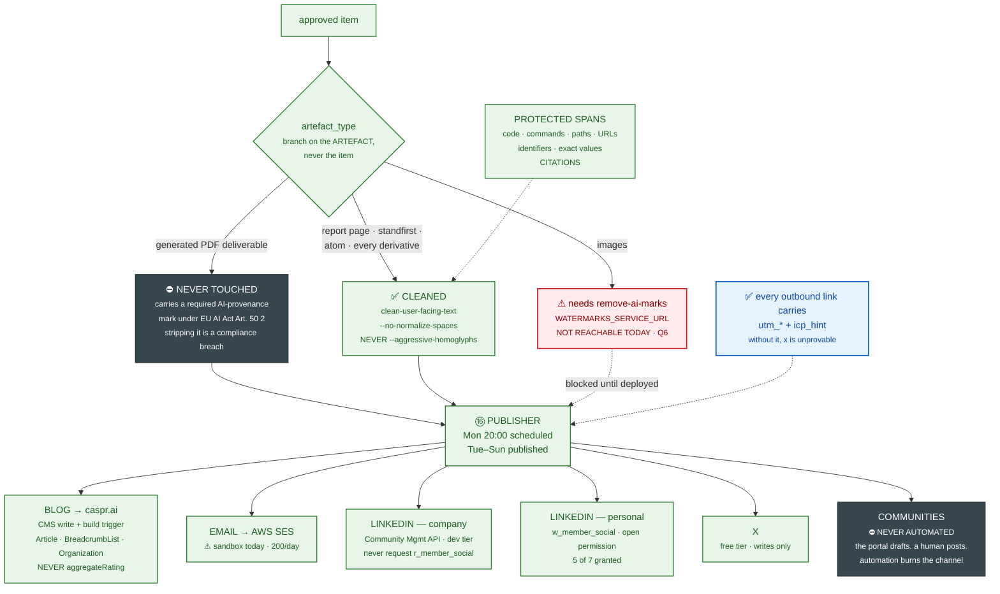
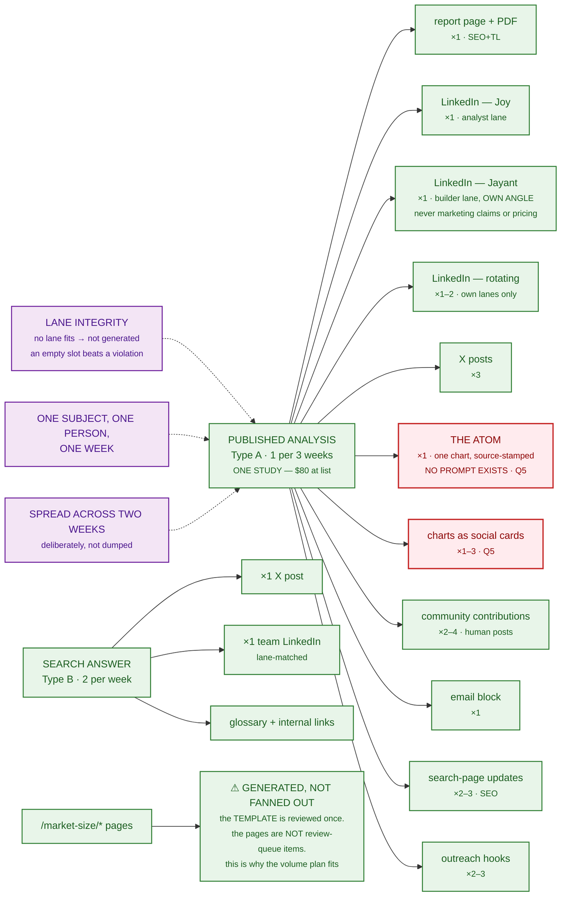
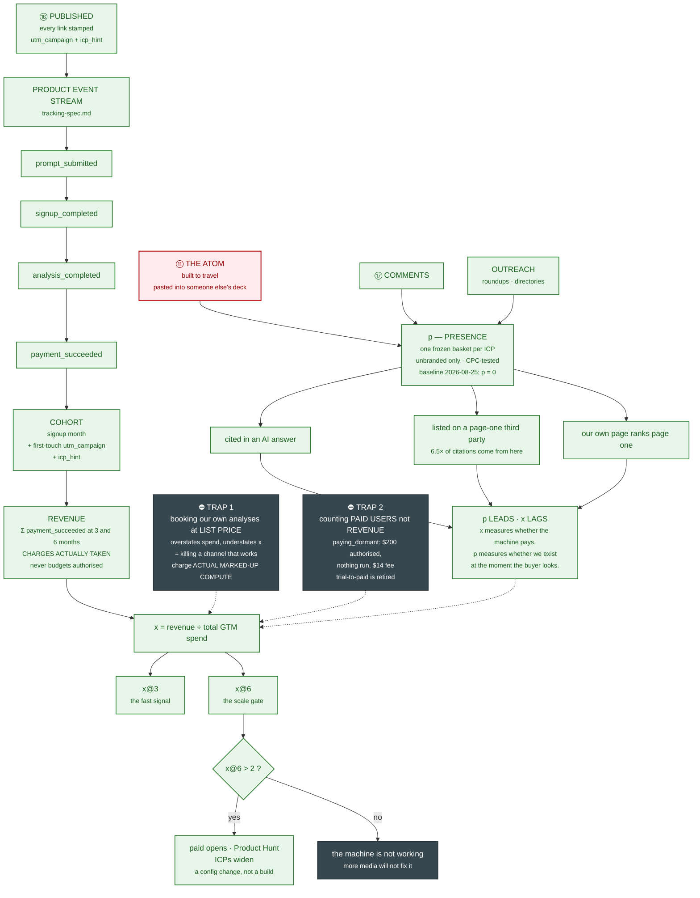
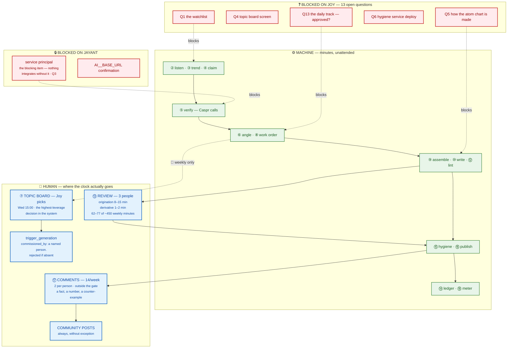

# Content Engine — The Flowcharts

*2026-09-08. The picture of [`content-engine-runtime-spec.md`](content-engine-runtime-spec.md).*

**This file holds the diagrams and nothing else.** Every rule, citation and open question lives in the runtime
spec; this is the same mechanism drawn. Station numbers ①–⑱ are the spec's numbering.

**Worked examples:** [`content-engine-example.md`](content-engine-example.md).

---

## Legend

| | |
|---|---|
| 🟢 **green** | Joy has specified it. Cited in the spec |
| 🟡 **amber** | **NEW** — our addition, inside her rules |
| 🔴 **red** | **GAP** — no spec exists yet |
| ⬛ **dark** | **HARD STOP** — the item is not produced, or does not publish |
| ⏱ | Daily clock |
| 📅 | Weekly clock |

---

## 1 · The master flow — two clocks, eighteen stations

---

## 2 · ⑤ The Verifier — the only station that calls Caspr

> **The `basis` field decides `diverges` against `definitional`, and it is enforced structurally — the model is
> never asked to make that call.** Reporting a definitional difference as a disagreement is *"the exact
> sloppiness we sell against."*

---

## 3 · ⑥ The Angle Desk — which clock a trend goes to

> **Case B in the example is a Gate 4 case.** The highest-velocity trend the engine will see is the one that
> must not become a headline — so it routes to outreach and to a founder post, never to a blog.

---

## 4 · ⑨⑩⑪⑫ Make — and the four ways the model refuses

> **A control token is a success, not an error. It is never retried.** *"The generator refusing is cheaper than
> the linter rejecting, and far cheaper than a reviewer approving something unsourced on a Friday."*

---

## 5 · ⑬⑭ Review and the loop that compounds

---

## 6 · ⑮⑯ Hygiene and publish — the branch that is a compliance boundary

---

## 7 · The fan-out — one analysis becomes 16–23 items

---

## 8 · ⑱ How it all reaches `x`

---

## 9 · Who does what — the swimlane

---

## 10 · Build order

```mermaid
flowchart LR
    P1["PHASE 1<br/>⑨ assembly · ⑩ writer<br/>⑫ linter · ⑭ ledger<br/><small>BLOCKED ON NOTHING<br/>the data model falls out of ⑨</small>"]
    P2["PHASE 2<br/>⑧ work order · ⑬ review<br/><small>one item end to end<br/>against mocks</small>"]
    P3["PHASE 3<br/>⑮ hygiene · ⑯ publisher<br/><small>needs SES production<br/>+ CMS write path</small>"]
    P4["PHASE 4<br/>⑤ verifier<br/><small>needs the SERVICE PRINCIPAL</small>"]
    P5["PHASE 5<br/>② ③ ④ ⑥ ⑦<br/><small>the intake half<br/>needs Q1 Q2 Q4 Q10</small>"]
    P6["PHASE 6<br/>⑪ visual · ⑰ comments<br/><small>needs Q5 Q6 Q8</small>"]
    P6B["PHASE 6b<br/>⏱ daily track<br/><small>a trigger, a flag, a timer<br/>needs Q13</small>"]
    P7["PHASE 7<br/>⑱ meter<br/><small>needs the app live</small>"]

    P1 --> P2 --> P3 --> P4 --> P5 --> P6 --> P6B --> P7

    START["START HERE<br/><small>list every brace in ⑨ and name its source.<br/>the data model for all eighteen stations<br/>falls out of that one exercise, and no<br/>open question touches it</small>"] --> P1

    classDef go fill:#e8f5e9,stroke:#2e7d32,stroke-width:2px,color:#1b5e20
    classDef wait fill:#fff8e1,stroke:#f9a825,stroke-width:1.5px,color:#7f5f00
    classDef start fill:#e3f2fd,stroke:#1565c0,stroke-width:2.5px,color:#0d47a1
    class P1,P2 go
    class P3,P4,P5,P6,P6B,P7 wait
    class START start
```

---

*Document: `content-engine-flowchart.md` · 2026-09-08 · The diagrams for
[`content-engine-runtime-spec.md`](content-engine-runtime-spec.md). **This file holds no rules.** Where a
diagram and the spec disagree, the spec is correct and the diagram is a bug — report it rather than following
it. Worked examples: [`content-engine-example.md`](content-engine-example.md).*
