# Content Engine — One Case, Drawn

*2026-09-09. The whole machine, as one trend moving through it.*

**This is [`content-engine-example.md`](content-engine-example.md) drawn instead of described.** Same case,
same numbers, same citations — the reasoning and the sources live there. **Where the two differ, the example is
correct and this is a bug.**

The abstract diagrams are in [`content-engine-flowchart.md`](content-engine-flowchart.md); the rules are in
[`content-engine-runtime-spec.md`](content-engine-runtime-spec.md).

---

## The case

> **Two research firms size the UK ready meals market differently.**
> 🟢 One says `$5.86bn` at `4.95%` CAGR. The other says `$6.46bn` at `12.4%`.
> **Same definition. Same base year. Neither page mentions the other.**

🟢 Real — [`index-engine.md`](index-engine.md) §1. And 🟢 the analysis already exists in the corpus:
*UK Ready Meals Market: Sizing and Analysis v1*, one of the three going on `/samples`.

🔵 Only the thread that starts it is illustrative — no listener is live yet.

---

## The whole thing on one page

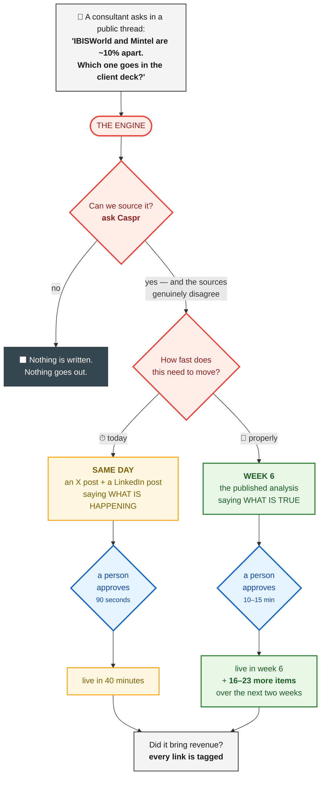

> **That is the whole engine.** Everything below is the same journey, one step at a time, with the real values
> in the boxes.

---

## Step 1 · The thread is read

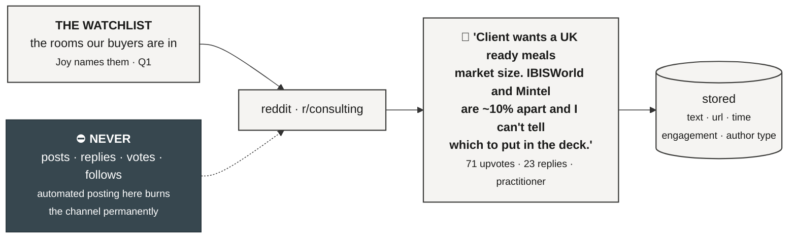

**Read-only. Every day.**

---

## Step 2 · It turns out to be a trend, not a one-off

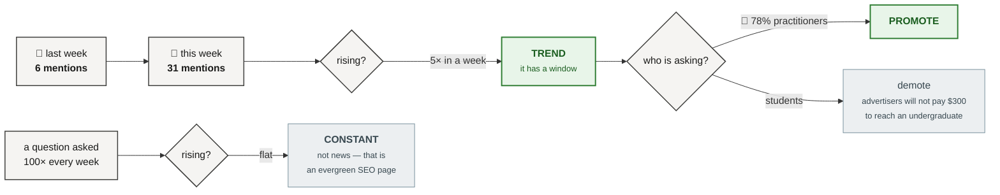

> **Velocity, not volume.** A question asked constantly belongs to SEO. A question rising this week has a
> window, and the window is the point.

---

## Step 3 · The claim is pulled out — with its **basis**

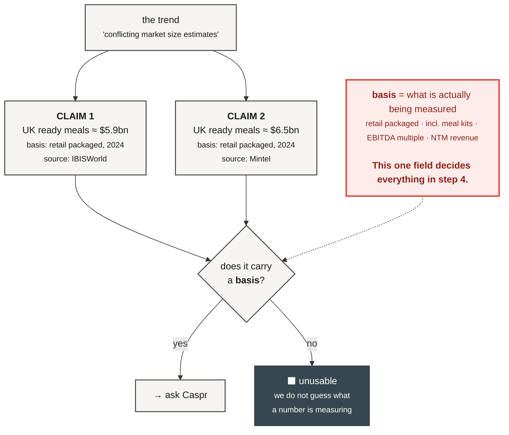

---

## Step 4 · Caspr is asked — and it costs nothing

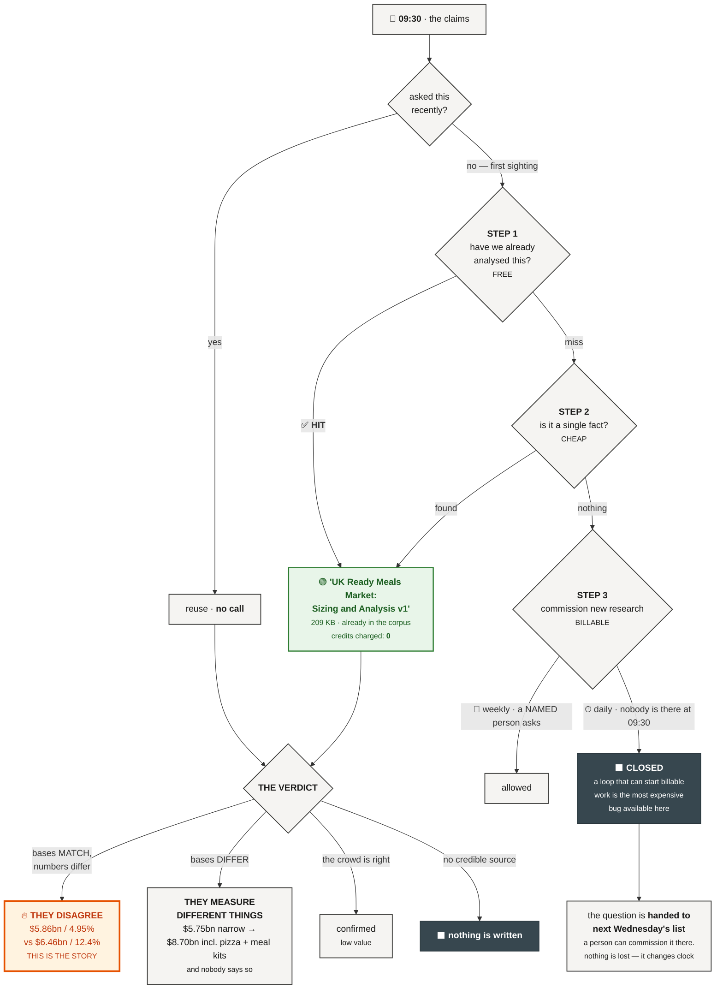

> **This case produced two verdicts, and that is the finding.** Most of the spread is definitional. **What
> survives after you control for definition is a real disagreement — and no page says which is which.**

---

## Step 5 · Four gates, then the fork

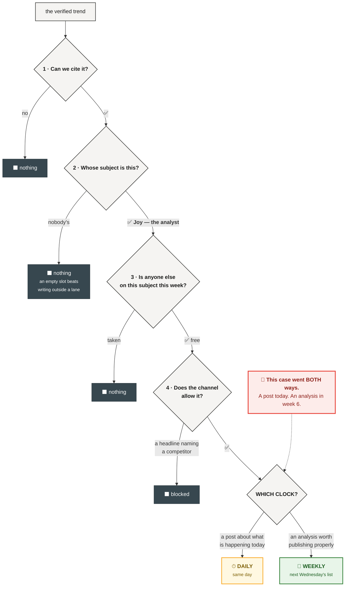

---

## Step 6 · ⏱ The daily track — live in forty minutes

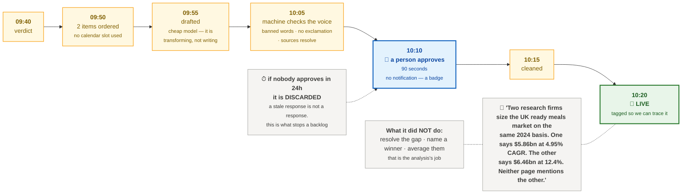

---

## Step 7 · 📅 The weekly track — a person picks

```mermaid
flowchart TD
    L["<b>Wednesday 15:00</b><br/>the 30-minute review<br/><small>same agenda every week</small>"]
    L --> LIST["🔵 <b>THE LIST</b>"]

    LIST --> R1["1 · AI research tool comparisons<br/><small>44 mentions · rising<br/>⚠️ <b>we cannot source it well</b></small>"]
    LIST --> R2["2 · vet practice multiples<br/><small>38 mentions · rising<br/>✅ sourced · but the crowd is right</small>"]
    LIST --> R3["3 · <b>conflicting market size estimates</b><br/><small>31 mentions · rising<br/>✅ sourced · <b>and they disagree</b></small>"]

    R1 -.->|"most mentions —<br/>and demoted anyway"| WHY["<b>a question we cannot<br/>source well makes a<br/>weak analysis</b>"]

    R3 --> PICK["👤 <b>Joy picks #3</b>"]
    PICK --> COMM["she commissions it<br/><small>her name goes in the record.<br/>the call is rejected without it</small>"]

    NOTE["<b>The best question is often the third.</b><br/><small>high demand, genuinely answerable,<br/>and nobody credible has answered it</small>"] -.- PICK

    GAP["🔴 <b>NO SCREEN EXISTS FOR THIS</b><br/><small>23 screens are drawn. this is not one of them · Q4</small>"] -.-> LIST

    classDef a fill:#e8f5e9,stroke:#2e7d32,stroke-width:1.5px,color:#1b5e20
    classDef hum fill:#e3f2fd,stroke:#1565c0,stroke-width:2.5px,color:#0d47a1
    classDef gap fill:#ffebee,stroke:#c62828,stroke-width:2.5px,color:#8e0000
    classDef note fill:#f5f4f2,stroke:#9e9e9a,color:#3c3c3a
    class L,LIST,R1,R2,R3,COMM a
    class PICK hum
    class GAP gap
    class NOTE,WHY note
```

---

## Step 8 · Thursday 06:00 — the week is built in one run

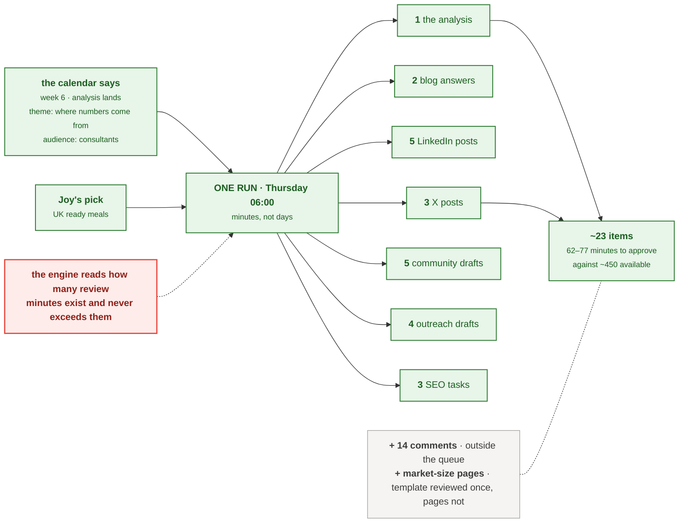

---

## Step 9 · Thursday to Monday — a person decides

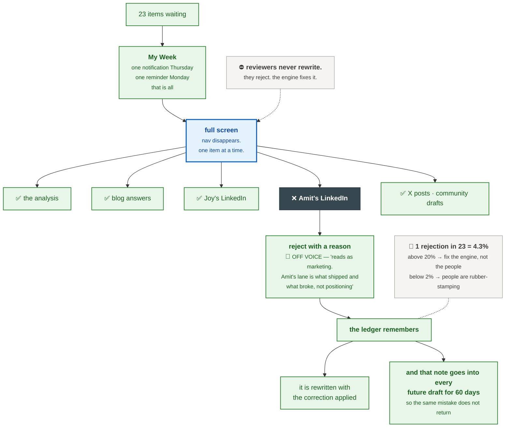

---

## Step 10 · Monday 20:00 — the branch that is a legal boundary

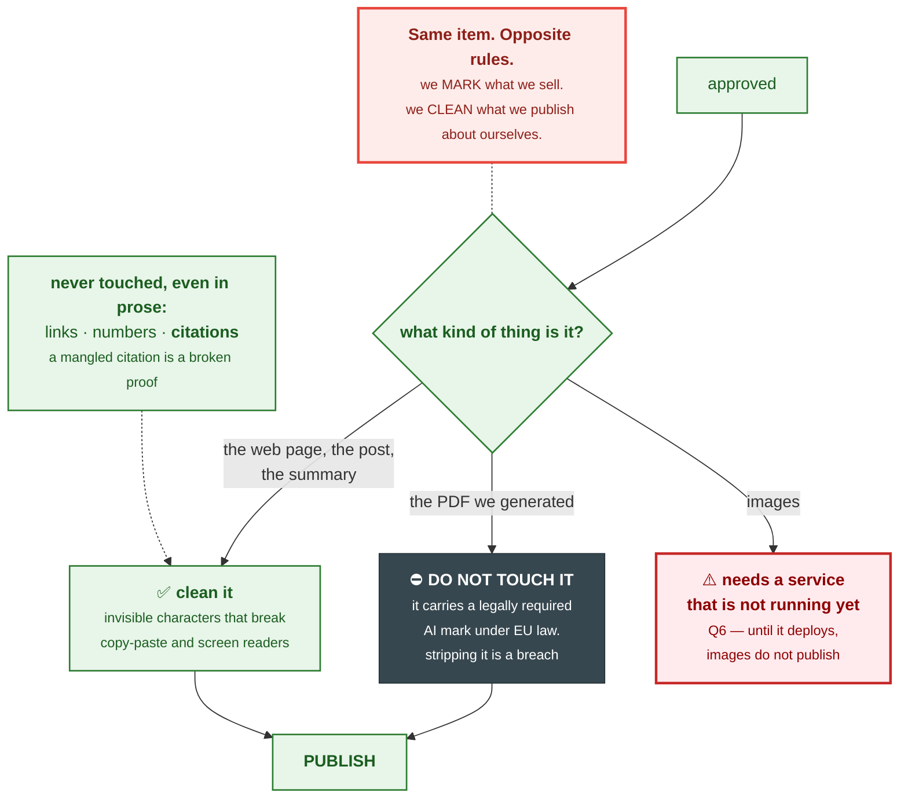

---

## Step 11 · Tuesday to Sunday — it goes out

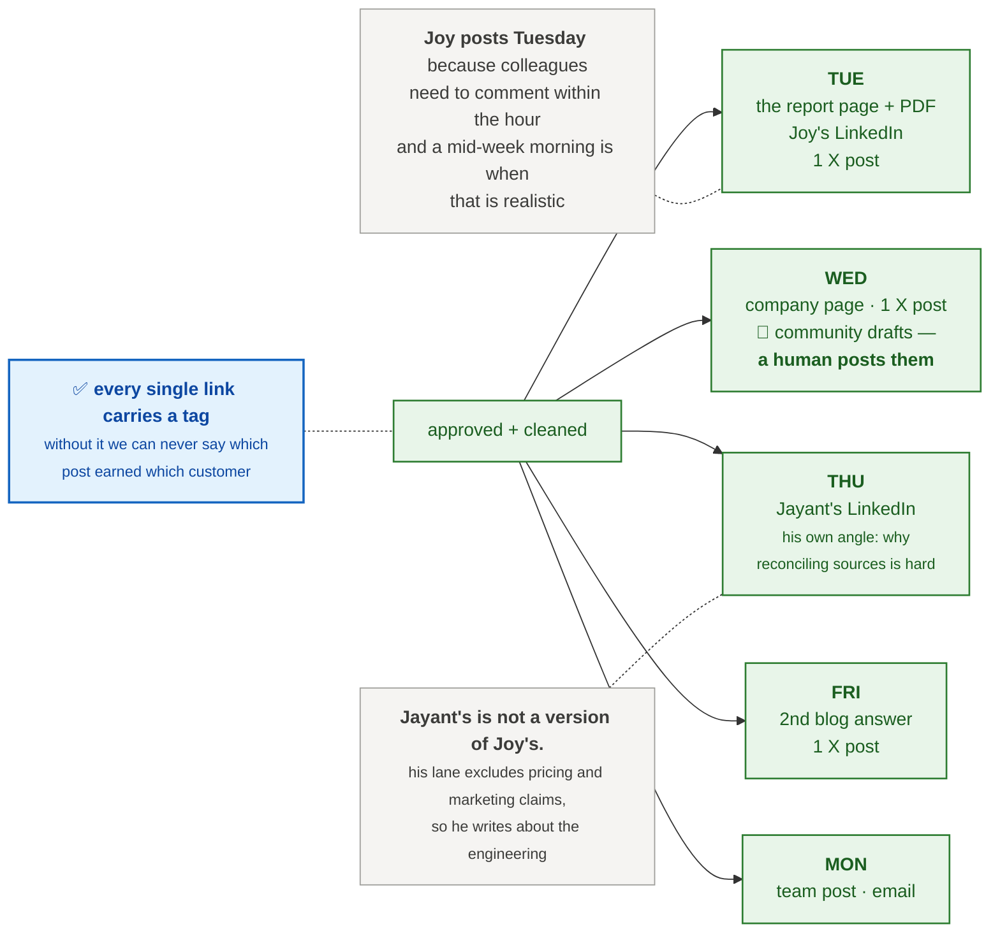

---

## Step 12 · One analysis becomes twenty items

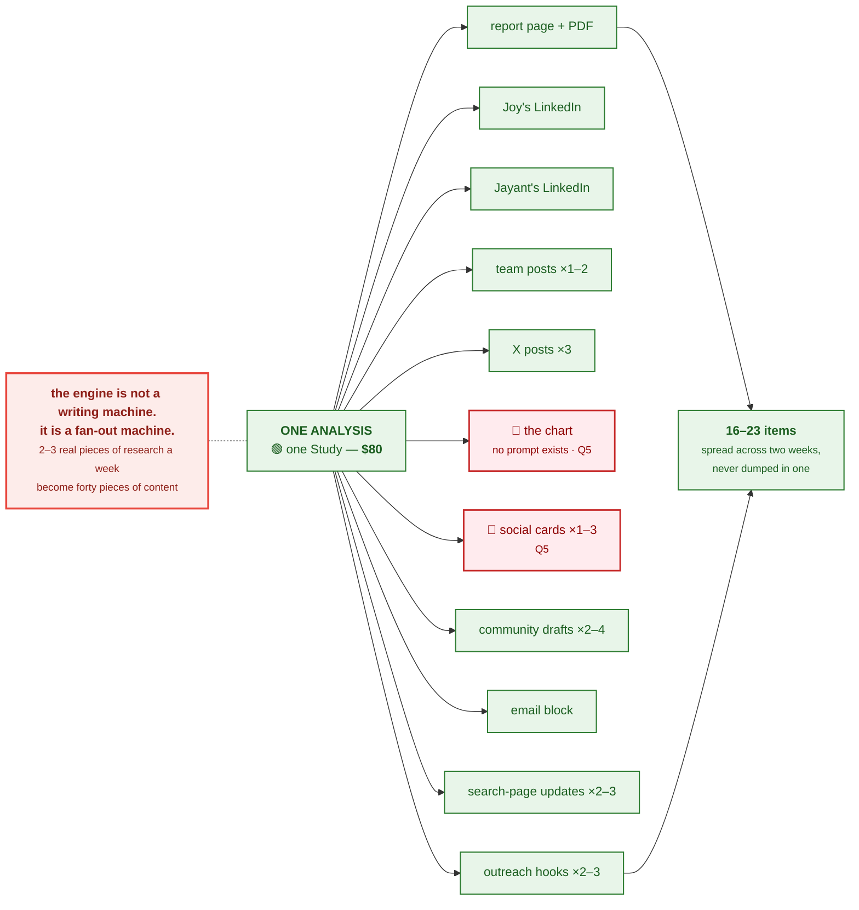

---

## Step 13 · Did it work?

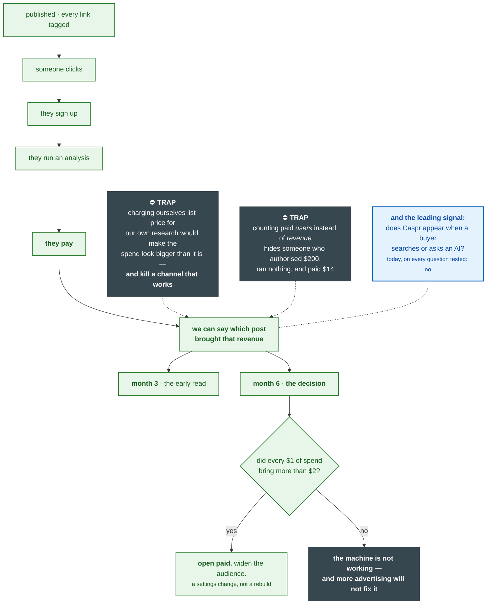

---

## What this one case cost

| | |
|---|---|
| **Caspr credits** | 🟢 **$0** — the analysis already existed, so the lookup was free |
| **Same-day post** | 🔵 **~2 minutes** of a person's time, live in 40 |
| **The week's 23 items** | 🟢 **62–77 minutes**, across three people |
| **The analysis itself** | 🟢 **$80** — one Study, and the parent of 16–23 items |
| **Things a person wrote from scratch** | 🟢 **2.5** for the whole week |

---

## Where it would have stopped

**Nine hard stops appear in the diagrams above. Every one is deliberate.**

| Where | What happens |
|---|---|
| No source | ⬛ **Nothing is written.** The engine refuses before the checker has to reject |
| A claim with no basis | ⬛ Unusable. We do not guess what a number measures |
| Sources older than 30 days | ⬛ Suppressed rather than published |
| Nobody's lane covers it | ⬛ **An empty slot beats writing outside a lane** |
| Someone else has the subject this week | ⬛ Not generated |
| A headline naming a competitor | ⬛ Blocked — that is the one thing the positioning exists to avoid |
| The voice check fails three times | ⬛ Flagged to a person. Never looped |
| ⏱ Nobody approves within 24 hours | ⬛ **Discarded.** Never carried forward |
| 📅 Nobody approves by Monday | ⬛ **It holds. We skip the week** — and skipping is a valid outcome |

> **The engine's most-used feature is refusing to publish.**

---

## Three things this case shows that are not yet built

| | 🔴 |
|---|---|
| **Step 7** | **No screen exists for the list Joy picks from.** 23 screens are drawn; this is not one · **Q4** |
| **Step 12** | **No prompt exists for the chart or the social cards** the fan-out already promises · **Q5** |
| **Step 10** | **The image-cleaning service is not reachable**, so images cannot publish · **Q6** |

**And one thing nobody can start without:** 🔴 the **machine credential** that lets the engine call Caspr at
all is not issued · **Q3**.

---

*Document: `content-engine-walkthrough.md` · 2026-09-09 · The same case as
[`content-engine-example.md`](content-engine-example.md), drawn rather than described. **Where the two differ,
the example is correct.** Rules: [`content-engine-runtime-spec.md`](content-engine-runtime-spec.md).
Abstract diagrams: [`content-engine-flowchart.md`](content-engine-flowchart.md).*
